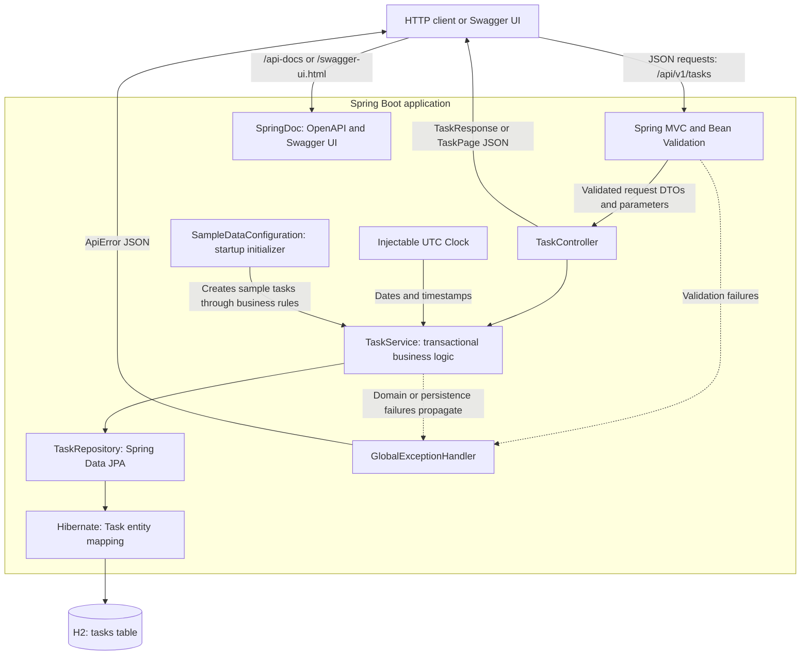
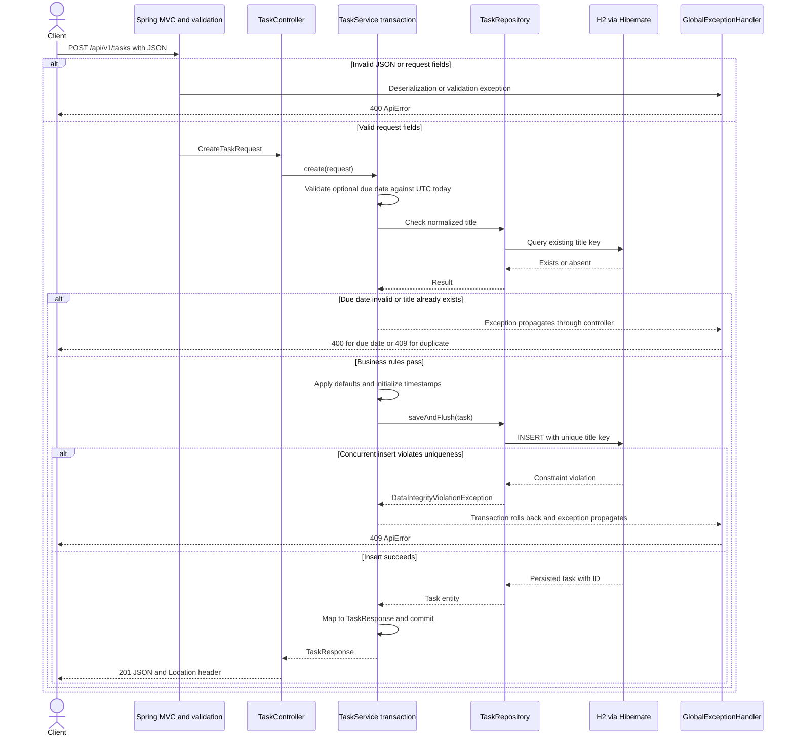
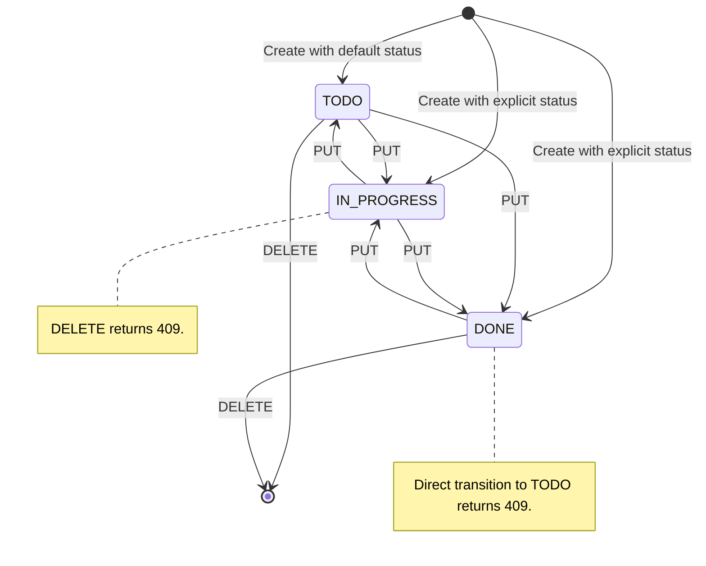

# Task API architecture

This document describes the implemented Spring Boot 4.1.1 application. See the
[README](README.md) for commands, request examples, and the complete API contract.
The diagrams render in Markdown viewers with Mermaid support, including GitHub.

## Application layers

The application runs as a single process with an embedded web server and an
in-memory H2 database. Controllers handle HTTP, the service owns transactions and
business rules, and Spring Data JPA handles persistence through Hibernate.

| Package | Responsibility |
| --- | --- |
| `controller` | Routes, input validation, HTTP status codes, and the creation `Location` header |
| `dto` | Create/update requests, task responses, pagination envelopes, and errors |
| `service` | Business rules, transaction boundaries, query pagination, and DTO mapping |
| `repository` | CRUD, normalized-title checks, and literal substring search |
| `entity` | Persisted task state, title normalization, timestamps, and optimistic-lock version |
| `exception` | Domain exceptions and centralized translation to HTTP errors |
| `config` | UTC clock, OpenAPI metadata, and conditional sample-data initialization |

Service reads use read-only transactions; writes use read-write transactions.
Entities are converted to response DTOs inside those transactions. Open Session
in View is disabled, so response serialization does not depend on an open JPA
session. Internal fields such as `titleKey` and `version` never appear in task
responses.

## Creating a task

Validation happens at two levels: Bean Validation checks the request shape, while
the service checks creation-specific rules. A database constraint remains the
final authority on title uniqueness, including when requests race.

The due-date check can stop processing before the title query. Defaults are
`TODO` and `MEDIUM` when their fields are omitted or null; explicit valid values
are accepted. Updates load the task, check the requested transition and title,
replace editable fields, advance `updatedAt`, and flush within one transaction.

## Task lifecycle

This diagram shows allowed changes between different statuses and deletion.
Updates that keep the same status are also allowed.

The rule blocks only a direct `DONE` → `TODO` transition. The implemented contract
allows reopening a completed task as `IN_PROGRESS`. A missing task returns 404;
the service checks existence before applying update or deletion rules.

## Persistence and consistency

There is one entity and one application table, with no entity relationships.

| Stored field | Purpose |
| --- | --- |
| `id` | Database-generated primary key |
| `title`, `description` | User text, limited to 100 and 500 characters respectively |
| `title_key` | Stripped, lowercased title using `Locale.ROOT`, protected by a unique constraint |
| `status`, `priority` | Enums stored by name rather than ordinal |
| `due_date` | Optional calendar date; future-date validation applies on creation only |
| `created_at`, `updated_at` | UTC instants with microsecond precision; creation time is immutable |
| `version` | JPA optimistic-lock version used to detect conflicting writes |

The unique constraint protects concurrent creates or renames that pass the
service's preliminary check. JPA version checks protect overlapping updates and
deletes; stale writes return 409. The version is internal: the API does not expose
an ETag or require a client version, so it does not detect an old client edit when
the service loads an already-updated row before applying that edit.

An injectable clock makes date rules testable. Every successful update advances
`updatedAt`; if the clock has not advanced, the entity adds one microsecond.
Search uses parameterized Spring Data queries and treats `%` and `_` literally.
Both list and search are paginated and ordered by ID ascending.

## Startup and verification

Hibernate creates the schema with `ddl-auto=create-drop`. When
`app.sample-data.enabled=true`, the startup initializer checks whether the table
is empty and creates three sample tasks through the service. Data resets on
restart. Configuration lives in `src/main/resources/application.properties`.

| Test layer | What it verifies |
| --- | --- |
| Mockito service tests | Business rules, defaults, pagination, and clock-driven timestamps |
| Full-context MockMvc tests | HTTP routes, JSON DTOs, validation, error responses, and OpenAPI |
| JPA repository tests | Database uniqueness, literal search, and optimistic locking |
| Error-handler and initializer tests | Safe error messages and conditional sample-data behavior |

`./mvnw clean verify` runs the suite and enforces JaCoCo coverage gates: 80%
overall line coverage, plus 80% line and branch coverage for each service class.
Authentication, rate limiting, and durable production storage remain outside the
implemented lab scope.
