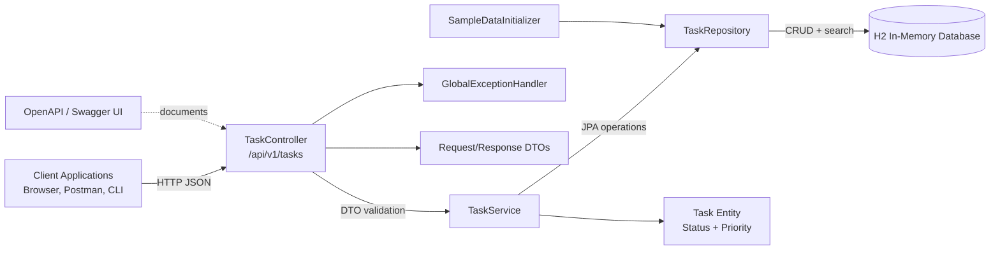
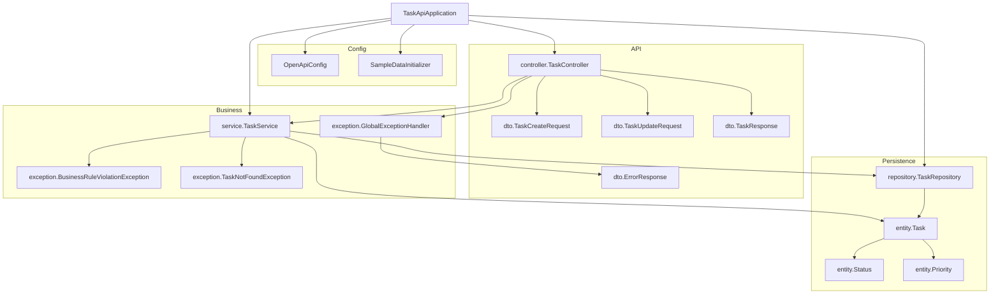
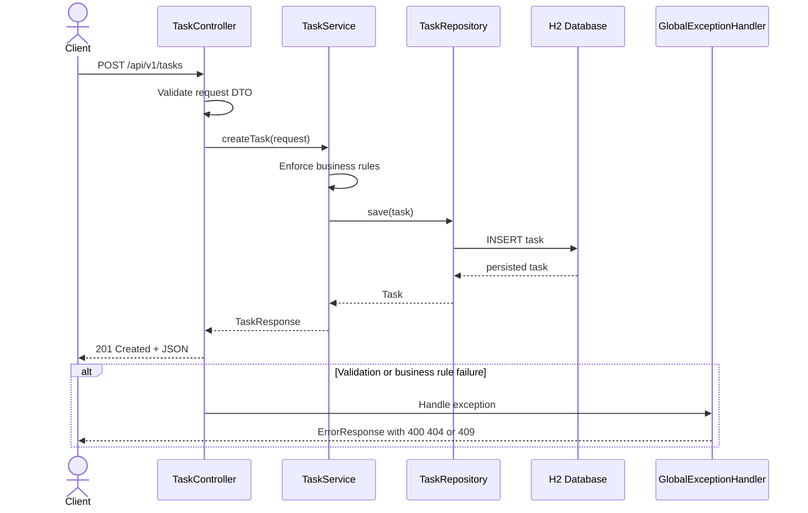
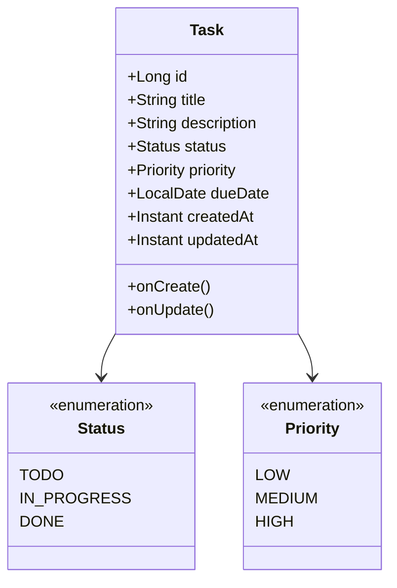
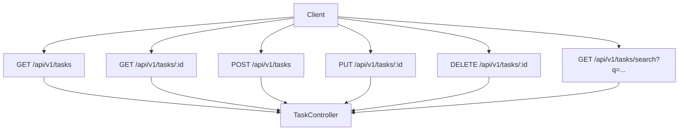

# Task API Architecture Diagrams

This document summarizes the current Spring Boot task management API using Mermaid diagrams.

## System Overview

## Package Structure

## Request Flow

## Domain Model

## Search And CRUD Endpoints

