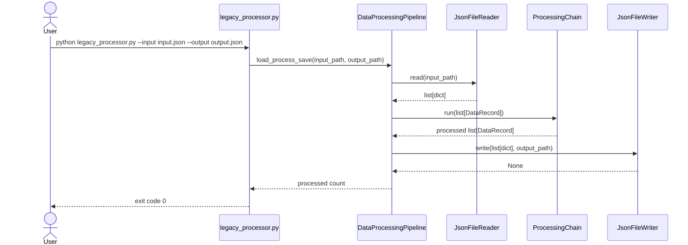

# Architecture Diagrams

These diagrams describe the refactored data processor at three levels: package
structure, runtime flow, and processing-chain behavior.

The rendered SVGs are embedded below so VS Code Markdown Preview works even
when a Mermaid extension is misconfigured. The editable Mermaid sources live in
`docs/diagrams/`:

- `docs/diagrams/package-structure.mmd`
- `docs/diagrams/runtime-flow.mmd`
- `docs/diagrams/processing-chain.mmd`
- `docs/diagrams/design-patterns.mmd`

## Package Structure

Source: `docs/diagrams/package-structure.mmd`

## Runtime Flow

Source: `docs/diagrams/runtime-flow.mmd`

## Processing Chain

Source: `docs/diagrams/processing-chain.mmd`

## Key Design Patterns

Source: `docs/diagrams/design-patterns.mmd`
