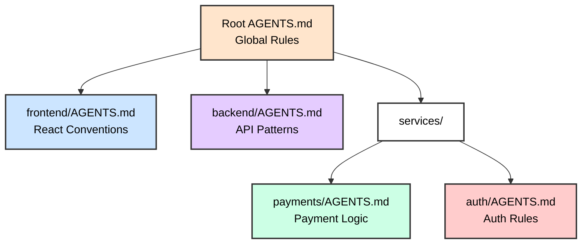
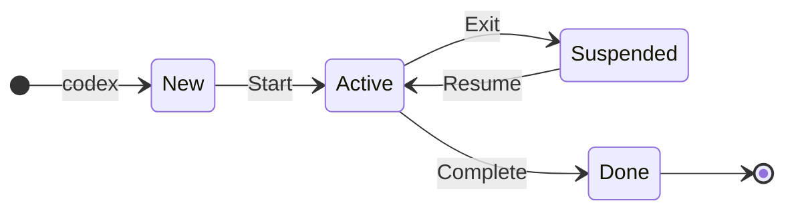
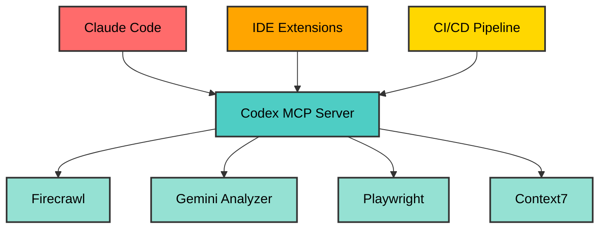

<style>
.slidev-page-num {
  display: block !important;
  opacity: 1 !important;
  visibility: visible !important;
  position: fixed !important;
  bottom: 1rem !important;
  right: 1rem !important;
  z-index: 100 !important;
  color: #666 !important;
  font-size: 0.875rem !important;
}
</style>

# OpenAI Codex CLI Training

## AI-Powered Terminal Coding Agent

<div class="pt-12">
  <span @click="$slidev.nav.next" class="px-2 py-1 rounded cursor-pointer" hover="bg-white bg-opacity-10">
    Press Space for next page <carbon:arrow-right class="inline"/>
  </span>
</div>

---

# Contact Info

Ken Kousen
Kousen IT, Inc.

- ken.kousen@kousenit.com
- http://www.kousenit.com
- http://kousenit.org (blog)
- Social Media:
  - [@kenkousen](https://twitter.com/kenkousen) (twitter)
  - [@kenkousen@foojay.social](https://foojay.social/@kenkousen) (mastodon)
  - [@kousenit.com](https://bsky.app/profile/kousenit.com) (bluesky)
- *Tales from the jar side* (free newsletter)
  - https://kenkousen.substack.com
  - https://youtube.com/@talesfromthejarside

---

# Course Overview

## 5-Hour Hands-On Workshop

<v-clicks>

- Installation and authentication strategies
- Terminal UI and navigation
- Sandbox modes and approval policies
- Real-world coding projects

</v-clicks>

---

# Topics We'll Cover

<v-clicks>

- Advanced TOML configuration
- MCP services integration
- Memory with AGENTS.md
- Custom prompts and profiles
- Multi-model provider support

</v-clicks>

---

# Prerequisites

<v-clicks>

- Command-line experience
- Basic programming knowledge
- Git familiarity
- Docker (for advanced exercises)

</v-clicks>

---

# What is OpenAI Codex CLI?

## Lightweight Terminal-Based Coding Agent

---

# Key Features

<v-clicks>

- Multi-model support (GPT, Claude, Ollama)
- Built-in safety with sandbox modes
- Rich configuration system
- Model Context Protocol (MCP) integration

</v-clicks>

---

# Advanced Capabilities

<v-clicks>

- Session persistence and resumption
- Custom prompts and profiles
- CI/CD compatible
- Headless execution

</v-clicks>

---

# Authentication Options

<v-clicks>

## ChatGPT Account (Recommended)
- Uses existing ChatGPT subscription
- Zero Data Retention (ZDR)
- Simplified login flow

## API Key
- Direct API access
- Pay-per-use pricing
- More configuration required

</v-clicks>

---

# Model Support

<v-clicks>

- OpenAI GPT models (default)
- Anthropic Claude via API
- Local models via Ollama
- Custom providers via configuration

</v-clicks>

---

# Installation Methods

```bash
# NPM (recommended)
npm install -g @openai/codex

# Homebrew (macOS/Linux)
brew install codex

# Direct binary download
# Visit: https://github.com/openai/codex/releases
```

---

# Verify Installation

```bash
codex --version
```

---

# Configuration Locations

<v-clicks>

- **Config**: `~/.codex/config.toml`
- **Prompts**: `~/.codex/prompts/`
- **Logs**: `~/.codex/log/`

</v-clicks>

---

# ChatGPT Account Login

```bash
# Interactive login
codex login

# Headless login for servers
codex login --headless
```

---

# API Key Authentication

```bash
# Set environment variable
export OPENAI_API_KEY="your-key"

# Or configure in TOML
echo 'api_key = "your-key"' >> ~/.codex/config.toml
```

---

# Verify Authentication

```bash
codex "Hello, are you working?"
```

---

# Starting Codex

```bash
# Interactive mode (default)
codex

# With initial prompt
codex "explain this codebase"

# Execute and exit mode
codex exec "generate a README"
```

---

# Key Bindings

<v-clicks>

- `Enter` - Submit prompt
- `Ctrl+C` - Cancel current operation
- `Ctrl+D` - Exit Codex
- `Tab` - Autocomplete
- `/` - Access slash commands

</v-clicks>

---

# Slash Commands

<v-clicks>

- `/status` - Show session info & token usage
- `/diff` - Review all pending changes
- `/clear` - Clear conversation history
- `/save` - Save current session
- `/help` - Show available commands
- `/settings` - Adjust runtime settings

</v-clicks>

---

# /diff Command - Review Changes

```diff
--- a/src/main.py
+++ b/src/main.py
@@ -10,7 +10,9 @@ def process_data(input_file):
-    data = json.load(f)
+    with open(input_file, 'r') as f:
+        data = json.load(f)
     return data

3 files changed, 47 insertions(+), 12 deletions(-)
```

Review line-by-line before approving!

---

# /status Command (v0.35+)

Shows comprehensive session information:

```
Current model: gpt-4
Session ID: abc123
Token usage: 15,432 / 128,000
Cost estimate: $0.46
Time elapsed: 12m 34s
```

---

# Search Your Codebase

```bash
# Search for text in your project
codex --search "TODO"
codex --search "authenticate"
codex --search "database connection"
```

<v-clicks>

- Fast semantic search across all files
- Understands code context
- Shows relevant snippets
- Great for exploration and debugging

</v-clicks>

---

# Web Search Capabilities

```toml
# ~/.codex/config.toml
[tools]
web_search = true
```

<v-clicks>

- Search the entire web for solutions
- Find latest documentation and tutorials
- Access Stack Overflow answers
- Get real-time information
- Research libraries and frameworks

</v-clicks>

---

# Using Web Search

```bash
# In interactive mode, Codex can search the web
codex
> "Search for the latest React 18 features"
> "Find Python async/await best practices"
> "What are the breaking changes in Spring Boot 3?"
```

<v-clicks>

- Automatic web search when needed
- Current information beyond training cutoff
- Verify solutions with official docs

</v-clicks>

---
layout: image-right
image: https://images.unsplash.com/photo-1555949963-ff9fe0c870eb?ixlib=rb-4.0.3&auto=format&fit=crop&w=1920&q=80
backgroundSize: cover
---

# Core Features

<div class="text-center mt-20">
  <h2 class="text-4xl font-bold text-white bg-black bg-opacity-60 px-6 py-3 rounded-lg">
    Essential Capabilities
  </h2>
  <p class="text-xl text-white bg-black bg-opacity-60 px-4 py-2 rounded mt-4">
    Master the fundamentals
  </p>
</div>

---

# Sandbox Modes


<v-clicks>

- **Read Only** - No file modifications
- **Auto** (default) - Smart restrictions
- **Full Access** - Unrestricted (use carefully!)

</v-clicks>

---

# Approval Policies

<v-clicks>

- **on-request** - Approve risky actions
- **never** - No approval prompts
- **on-failure** - Approve only on failures

</v-clicks>

---

# Setting Safety Options

```bash
# Set sandbox mode
codex --sandbox-mode read-only

# Set approval policy
codex --approval-policy never

# Bypass all safety (dangerous!)
codex --dangerously-bypass-approvals-and-sandbox
```

---

# Project Memory: AGENTS.md

## Automatic Context Loading

<v-clicks>

- Place `AGENTS.md` in project root
- Loaded automatically with first prompt
- Configurable size limit (default: 32KB)

</v-clicks>

---

# Example AGENTS.md

```markdown
# Project: E-Commerce Platform

## Tech Stack
- Backend: Node.js + Express
- Database: PostgreSQL
- Frontend: React + TypeScript
```

---

# AGENTS.md Best Practices

```markdown
## Conventions
- Use async/await for all async operations
- Follow RESTful API patterns
- Write tests for all new features

## Current Focus
Working on payment integration with Stripe
```

---

# Hierarchical AGENTS.md (v0.39+)



Rules cascade: Subfolder overrides parent

---

# Context Cascade Benefits

<v-clicks>

- Global rules apply everywhere
- Subfolder rules override parent
- Each team owns their conventions
- Frontend/backend stay independent
- Microservices maintain autonomy

</v-clicks>

---

# Custom Prompts

## Creating Custom Prompts

<v-clicks>

1. Create `.md` file in `~/.codex/prompts/`
2. Access via slash commands
3. Reusable across projects

</v-clicks>

---

# Example Custom Prompt

```markdown
# ~/.codex/prompts/refactor.md
Refactor the selected code following these principles:
1. Extract complex logic into small functions
2. Use meaningful variable names
3. Add appropriate error handling
```

---

# Prompt Template: Security Audit

```markdown
# ~/.codex/prompts/security-audit.md
Perform a comprehensive security audit:

1. Check for SQL injection vulnerabilities
2. Identify hardcoded secrets or API keys
3. Review authentication/authorization logic
4. Scan for XSS vulnerabilities
5. Check for insecure dependencies
6. Review encryption and hashing methods

For each issue found:
- Explain the vulnerability
- Show how to fix it
- Rate severity (Critical/High/Medium/Low)
```

---

# Prompt Template: Test Generator

```markdown
# ~/.codex/prompts/test-gen.md
Generate comprehensive tests for the current code:

1. Unit tests for all public methods
2. Edge cases and error conditions
3. Mock external dependencies
4. Use appropriate assertions
5. Follow AAA pattern (Arrange, Act, Assert)
6. Include performance tests if applicable

Use the project's existing test framework.
Coverage target: 80% minimum
```

---

# Prompt Template: PR Review

```markdown
# ~/.codex/prompts/pr-review.md
Review this code as a senior engineer would:

## Check for:
- Bugs and logic errors
- Performance issues
- Security vulnerabilities
- Code style violations
- Missing tests

## Provide:
- Line-by-line feedback
- Suggested improvements
- Overall assessment
```

---

# Prompt Template: API Upgrade

```markdown
# ~/.codex/prompts/api-upgrade.md
Migrate this code to use the latest API version:

1. Identify all deprecated method calls
2. Replace with modern equivalents
3. Update import statements
4. Adjust types/interfaces as needed
5. Maintain backward compatibility
6. Add migration notes as comments
7. Update tests to match new API

Show a diff of all changes.
```

---

# Prompt Template: Performance Fix

```markdown
# ~/.codex/prompts/perf-fix.md
Analyze and optimize performance:

1. Identify bottlenecks (O(n²) loops, etc.)
2. Suggest algorithmic improvements
3. Add caching where appropriate
4. Optimize database queries
5. Reduce memory allocations
6. Consider async/parallel processing

Target: 50% performance improvement
```

---

# Using Custom Prompts

```bash
/refactor
/security-audit
/test-gen
/pr-review
/api-upgrade
/perf-fix
```

---

# Prompt Arguments Workaround

Codex doesn't support `$ARGUMENTS` like Claude Code, but you can use shell scripts:

```bash
#!/bin/bash
# ~/.codex/scripts/review-file.sh

FILE=$1
FOCUS=$2

cat > /tmp/review-prompt.md << EOF
Review the file ${FILE} focusing on ${FOCUS}:
- Check for bugs and errors
- Suggest improvements
- Rate code quality
EOF

codex exec "$(cat /tmp/review-prompt.md)"
```

Usage: `./review-file.sh UserService.java security`

---

# Configuration Profiles

## Define Multiple Profiles

```toml
# ~/.codex/config.toml

[profiles.production]
model = "gpt-4"
approval_policy = "on-request"
sandbox_mode = "auto"

[profiles.development]
model = "gpt-4o-mini"
approval_policy = "never"
sandbox_mode = "full-access"
```

---

# Using Profiles

```bash
codex --profile production
codex --profile development
codex --profile testing
```

---

# Resume Previous Sessions

```bash
# Resume most recent session
codex --resume

# Resume specific session
codex --resume-session abc123
```

---

# Session Lifecycle



**Commands**: `codex`, `codex --resume`, `codex --list-sessions`

---

# Session Commands

```bash
# List available sessions
codex --list-sessions

# Clear old sessions
codex --clear-sessions
```

---

# Non-Interactive Sessions

```bash
# Run in CI/CD pipeline
codex exec "update dependencies and fix breaking changes"

# Note: For resuming, use regular resume
codex --resume
```

---
layout: image-right
image: https://images.unsplash.com/photo-1488590528505-98d2b5aba04b?ixlib=rb-4.0.3&auto=format&fit=crop&w=1920&q=80
backgroundSize: cover
---

# Advanced Features

<div class="mt-20">
  <h2 class="text-4xl font-bold text-white bg-black bg-opacity-60 px-6 py-3 rounded-lg">
    Power User Tools
  </h2>
  <p class="text-xl text-white bg-black bg-opacity-60 px-4 py-2 rounded mt-4">
    Unlock full potential
  </p>
</div>

---

# Model Context Protocol (MCP)

## Configure MCP Servers

---

# GitHub MCP Server

```toml
[mcp_servers.github]
command = "npx"
args = ["@modelcontextprotocol/server-github"]
env = { GITHUB_TOKEN = "${GITHUB_TOKEN}" }
```

---

# Database MCP Server

```toml
[mcp_servers.postgres]
command = "npx"
args = ["@modelcontextprotocol/server-postgres"]
env = { CONNECTION_STRING = "${DATABASE_URL}" }
```

---

# MCP Startup Guardrails (v0.31+)

Prevent flaky tools from freezing Codex:

```toml
[mcp_servers.github]
command = "npx"
args = ["@modelcontextprotocol/server-github"]
startup_timeout_ms = 15000  # Abort after 15 seconds
```

---

# MCP Timeout Benefits

<v-clicks>

- Clean abort when helpers fail to boot
- Prevents entire run from freezing
- Better error messages
- Faster feedback on configuration issues

</v-clicks>

---

# MCP Usage

<v-clicks>

- Automatically available when configured
- Access external tools and data
- Extend Codex capabilities

</v-clicks>

---

# Running Codex as MCP Server

```bash
# Modern approach (v0.37+)
codex mcp --config ~/.codex/config.toml

# Legacy approach
codex serve --port 8080
```

---

# MCP Architecture



---

# MCP Server Benefits

The `codex mcp` command exposes Codex as a tool:

<v-clicks>

- Other agents can call Codex workflows
- IDEs can integrate without plugins
- Claude Code can use as sub-agent
- Mix model strengths (GPT + Claude)

</v-clicks>

---

# Why Codex as Sub-Agent?

<v-clicks>

- Leverage GPT-5-Codex for complex tasks
- Use Codex's specialized prompts
- Access different model providers
- Unified approval/sandbox policies

</v-clicks>

---

# Integration Example

```bash
# Add Codex as MCP server in Claude Code
claude mcp add codex -- codex mcp

# List MCP servers
claude mcp list

# Remove if needed
claude mcp remove codex
```

---

# Integration Options

<v-clicks>

- Connect from other MCP clients
- Use in multi-agent workflows
- Integrate with IDEs

</v-clicks>

---

# Example Client Connection

```javascript
const client = new MCPClient({
  url: 'http://localhost:8080',
  capabilities: ['code-generation', 'review']
});
```

---

# Multi-Model Provider Support

## Configure Alternative Providers

---

# Anthropic Claude

```toml
[providers.anthropic]
type = "anthropic"
api_key = "${ANTHROPIC_API_KEY}"
model = "claude-3-opus-20240229"
```

---

# Local Ollama

```toml
[providers.ollama]
type = "ollama"
base_url = "http://localhost:11434"
model = "codellama"
```

---

# Azure OpenAI

```toml
[providers.azure]
type = "azure-openai"
api_key = "${AZURE_API_KEY}"
endpoint = "https://myinstance.openai.azure.com"
deployment = "gpt-4"
```

---

# Switch Providers

```bash
codex --provider anthropic
codex --provider ollama
codex --provider azure
```

---

# Enable Detailed Logging

```bash
# Set log level
export RUST_LOG=debug
codex

# Trace level (maximum detail)
export RUST_LOG=trace
codex
```

---

# Log Locations

<v-clicks>

- Interactive: `~/.codex/log/codex-tui.log`
- Non-interactive: stderr output
- Custom: Redirect with shell operators

</v-clicks>

---

# Debug Configuration

```toml
# ~/.codex/config.toml
[logging]
level = "debug"
file = "/path/to/custom.log"
```

---

# CI/CD Integration

## GitHub Actions Example

---

# GitHub Actions Setup

```yaml
name: AI Code Review
on: [pull_request]

jobs:
  review:
    runs-on: ubuntu-latest
```

---

# Install and Authenticate

```yaml
steps:
  - uses: actions/checkout@v3
  - name: Install Codex
    run: npm install -g @openai/codex
  - name: Login to Codex
    run: codex login --headless
    env:
      OPENAI_API_KEY: ${{ secrets.OPENAI_API_KEY }}
```

---

# Run Code Review

```yaml
- name: Review Code
  run: |
    codex exec "Review this PR for bugs,
                performance issues, and best practices"
```

---

# Scheduled Code Maintenance

Use `codex exec` with cron for automated maintenance:

```bash
# Weekly security check (crontab)
0 2 * * 1 cd /path/to/repo && \
  codex exec "identify and fix any security \
  vulnerabilities or deprecated API usage"
```

---

# Ambitious: Nightly Dependency Updates

```bash
# Sunday 3am: Auto-update all dependencies
0 3 * * 0 cd /path/to/repo && \
  git pull && \
  codex exec "update all dependencies to their \
              latest versions and resolve any \
              breaking changes" && \
  git commit -am "Auto-update dependencies" && \
  git push
```

**Wake up to a ready-to-review PR!** 🌅

---

# Nightly Update Safeguards

<v-clicks>

- Push to a **separate branch**, not main
- Use **--dry-run** first to test
- Set up **notifications** for failures
- Run **comprehensive tests** before push
- Consider **semantic versioning** limits

</v-clicks>

```bash
# Safer version with branch
git checkout -b auto-update-$(date +%Y%m%d) && \
codex exec "update dependencies" && \
npm test && \
git push origin HEAD
```

---

# Maintenance Automation Examples

```bash
# Daily dependency check
codex exec "check for outdated dependencies \
            and update to latest stable versions"

# Weekly security audit
codex exec "scan for insecure crypto usage, \
            SQL injection risks, or exposed secrets"

# Monthly code cleanup
codex exec "identify dead code, unused imports, \
            and refactor for better performance"
```

---

# Automated Maintenance Best Practices

<v-clicks>

- Always review changes before merging
- Use sandbox mode for safety
- Create separate branch for fixes
- Set up notifications for runs
- Keep audit logs of changes

</v-clicks>

**Remember:** Codex drafts solutions, you review and approve

---

# Chain Commands with &&

Create fail-fast pipelines using `&&`:

```bash
# Only proceed if each step succeeds
git pull && \
codex exec "migrate database schema to latest version" && \
npm test
```

If any step fails, execution stops immediately

---

# Command Chaining Examples

```bash
# Update, migrate, test
git pull && \
codex exec "update dependencies to fix vulnerabilities" && \
codex exec "migrate breaking changes" && \
npm test && \
git commit -am "Update dependencies"

# Build pipeline
npm install && \
codex exec "fix any TypeScript errors" && \
npm run build && \
npm test
```

---

# Why Use && Chaining?

<v-clicks>

- **Fail-fast behavior** - Stop on first error
- **Dependency ordering** - Each step needs the previous
- **Atomic operations** - All succeed or nothing commits
- **CI/CD friendly** - Clear success/failure signal
- **Prevents partial updates** - No broken states

</v-clicks>

**Alternative:** Use `||` for fallback commands

---

# Advanced TOML Configuration

```toml
# ~/.codex/config.toml
model = "gpt-4o"
model_provider = "openai"
approval_policy = "on-request"
sandbox_mode = "auto"

[tools]
web_search = true
```

---

# Environment & Notifications

```toml
[notification]
program = "notify-send"
args = ["Codex", "Task completed"]

[shell_environment]
NODE_ENV = "development"
PYTHONPATH = "/usr/local/lib/python3.9"
```

---

# Shell Environment Policies

<v-clicks>

- **inherit** - Use parent shell environment
- **explicit** - Only specified variables
- **minimal** - Basic environment only

</v-clicks>

---

# Environment Configuration

```toml
# Inherit all variables
shell_environment_policy = "inherit"

# Explicit variables only
shell_environment_policy = "explicit"
```

---

# Explicit Environment

```toml
[shell_environment]
PATH = "/usr/local/bin:/usr/bin:/bin"
HOME = "/home/user"
LANG = "en_US.UTF-8"
```

---

# Security Considerations

<v-clicks>

- Use `explicit` for production
- Use `inherit` for development
- Never expose secrets in config

</v-clicks>

---

# Notification System

## Configure External Notifications

---

# macOS Notifications

```toml
[notification]
program = "osascript"
args = ["-e", "display notification \"Task complete\" with title \"Codex\""]
```

---

# Linux Notifications

```toml
[notification]
program = "notify-send"
args = ["Codex", "Task completed"]
```

---

# Webhook Notifications

```toml
[notification]
program = "curl"
args = ["-X", "POST", "https://hooks.slack.com/...", "-d", "{\"text\":\"Done\"}"]
```

---

# Notification Triggers

<v-clicks>

- On task completion
- On approval required
- On errors (configurable)

</v-clicks>

---
layout: image-left
image: https://images.unsplash.com/photo-1498050108023-c5249f4df085?ixlib=rb-4.0.3&auto=format&fit=crop&w=1920&q=80
backgroundSize: cover
---

# Practical Exercises

<div class="mt-20">
  <h2 class="text-4xl font-bold text-white bg-black bg-opacity-70 px-6 py-3 rounded-lg">
    Hands-On Labs
  </h2>
  <p class="text-xl text-white bg-black bg-opacity-70 px-4 py-2 rounded mt-4">
    Learn by doing
  </p>
</div>

---

# Exercise Structure

## Three Main Categories

---

# 1. Generate from Scratch

<v-clicks>

- Spring Boot REST API
- Python CLI tool
- React dashboard

</v-clicks>

---

# 2. Refactor Existing Code

<v-clicks>

- Legacy Java modernization
- Python code quality improvements
- TypeScript migration

</v-clicks>

---

# 3. Multi-Language Projects

<v-clicks>

- Microservices architecture
- Full-stack application
- Data pipeline

</v-clicks>

---

# Each Exercise Includes

<v-clicks>

- Starting code
- Requirements
- Expected outcomes
- Solution walkthrough

</v-clicks>

---

# Lab 1: Spring Boot API

## Build a Complete REST API

---

# Spring Boot Requirements

```markdown
1. REST endpoints for CRUD operations
2. H2 in-memory database
3. Input validation
4. Exception handling
5. OpenAPI documentation
6. Comprehensive tests
```

---

# Starting Prompts

```bash
# Start with project structure
codex "Generate a Spring Boot 3.2 project
       structure for a task management API"
```

---

# Build the API

```bash
# Add domain model
codex "Create JPA entities for Task"

# Generate complete API
codex "Implement REST controllers with
       proper error handling and validation"
```

---

# Lab 2: Python Refactoring

## Transform Legacy Code

---

# Starting Legacy Code

```python
# calculator.py - needs refactoring
def calc(x,y,op):
    if op=="add": return x+y
    elif op=="sub": return x-y
    elif op=="mul": return x*y
    elif op=="div": return x/y
```

---

# Refactoring Goals

<v-clicks>

- Add type hints
- Proper error handling
- Strategy pattern
- Comprehensive docstrings
- pytest test suite with 100% coverage

</v-clicks>

---

# Codex Refactoring

```bash
codex "Refactor this calculator to use
       modern Python best practices"
```

---

# Lab 3: React TypeScript Forms

## Build a Registration System

---

# Form Requirements

<v-clicks>

- Email/password validation using Zod
- React Hook Form integration
- Accessibility (ARIA) compliance
- Jest + React Testing Library tests
- Responsive Tailwind CSS styling

</v-clicks>

---

# Progressive Enhancement

<v-clicks>

1. Start with basic form
2. Add validation
3. Implement testing
4. Add accessibility
5. Optimize performance

</v-clicks>

---

# Generate the Form

```bash
codex "Create a React TypeScript
       registration form with Zod validation
       and full test coverage"
```

---

# Lab 4: Microservices

## Multi-Service Architecture

---

# Configure Project Context

```bash
echo "# Microservices Project
Tech: Node.js, Python, Go
Pattern: Event-driven with RabbitMQ
Deploy: Docker Compose" > AGENTS.md
```

---

# Service Components

<v-clicks>

- Auth Service (Node.js) - JWT authentication
- Order Service (Python FastAPI) - Order processing
- Notification Service (Go) - Email/SMS alerts

</v-clicks>

---

# Generate Services

```bash
codex "Create microservices architecture with
       Docker setup and message queue integration"
```

---

# Key Learning Points

<v-clicks>

- Cross-language generation
- Service communication
- Container orchestration

</v-clicks>

---

# Lab 5: Database Migration

## Modernize Legacy Database

---

# Setup Database MCP

```bash
codex "Configure MCP server for PostgreSQL connection"
```

---

# Migration Steps

```bash
# Analyze schema
codex "Analyze database schema"

# Create migration plan
codex "Create migration to normalized structure"

# Generate scripts
codex "Generate Flyway migration scripts"
```

---

# Skills Practiced

<v-clicks>

- MCP integration
- Database analysis
- Safe migrations

</v-clicks>

---

# Lab 6: AI Code Review

## Automated PR Reviews

---

# Workflow Configuration

```yaml
# .github/workflows/ai-review.yml
name: Codex Review
on: [pull_request]

jobs:
  ai-review:
    runs-on: ubuntu-latest
```

---

# Setup Review Profile

```yaml
- name: Configure Codex
  run: |
    echo "[profiles.review]
    sandbox_mode = \"read-only\"
    approval_policy = \"never\"" > ~/.codex/config.toml
```

---

# Run Review

```yaml
- name: Review Changes
  run: |
    codex exec --profile review \
      "Review for: security issues,
       performance problems, best practices"
```

---

# Advanced Exercise

## Full-Stack E-Commerce

---

# Phase 1: Backend

```bash
codex "Create Spring Boot backend with:
- Product catalog management
- User authentication (JWT)
- Order processing workflow
- PostgreSQL with Liquibase"
```

---

# Phase 2: Frontend

```bash
codex "Create React frontend with:
- Product browsing with filters
- Shopping cart (Redux)
- Checkout process
- Admin dashboard"
```

---

# Phase 3: DevOps

```bash
codex "Add Docker Compose setup with
       nginx, monitoring, and CI/CD pipeline"
```

---
layout: image-right
image: https://images.unsplash.com/photo-1516321318423-f06f85e504b3?ixlib=rb-4.0.3&auto=format&fit=crop&w=1920&q=80
backgroundSize: cover
---

# Best Practices

<div class="text-center mt-20">
  <h2 class="text-4xl font-bold text-white bg-black bg-opacity-60 px-6 py-3 rounded-lg">
    Professional Workflows
  </h2>
  <p class="text-xl text-white bg-black bg-opacity-60 px-4 py-2 rounded mt-4">
    Enterprise-ready patterns
  </p>
</div>

---

# Review Changes Before Approving

<v-clicks>

- Codex displays unified diffs automatically
- Use `/diff` to see all pending changes
- Review line-by-line for unintended edits
- Check file statistics (insertions/deletions)
- Catch mistakes before they land in codebase

</v-clicks>

**Pro tip:** Always review diffs for:
- Accidental deletions
- Unrelated file changes
- Security implications

---

# Security Best Practices

## Sandbox Configuration by Environment

---

# Development Profile

```toml
[profiles.dev]
sandbox_mode = "full-access"
approval_policy = "never"
```

---

# Staging Profile

```toml
[profiles.staging]
sandbox_mode = "auto"
approval_policy = "on-request"
```

---

# Production Profile

```toml
[profiles.prod]
sandbox_mode = "read-only"
approval_policy = "on-request"
```

---

# Security Guidelines

<v-clicks>

- Never store API keys in config files
- Use environment variables for secrets
- Enable approval for production
- Regular audit of generated code
- Restrict network access in sandbox

</v-clicks>

---

# Team Collaboration

## Shared Configuration

---

# Project AGENTS.md

```markdown
# Team: Platform Engineering
## Conventions
- PR reviews required for all changes
- Follow company style guide
- Security scanning mandatory
- 80% test coverage minimum
```

---

# Current Sprint Context

```markdown
## Current Sprint
- Migrating to Kubernetes
- Implementing OAuth 2.0
```

---

# Shared Prompts Repository

```bash
# Clone team prompts
git clone team-repo/codex-prompts ~/.codex/prompts

# Keep synchronized
cd ~/.codex/prompts && git pull
```

---

# Model Selection Strategy

```toml
[profiles.quick]
model = "gpt-3.5-turbo"  # Fast responses

[profiles.complex]
model = "gpt-4"  # Complex reasoning
```

---

# Local Models

```toml
[profiles.local]
provider = "ollama"
model = "codellama"  # No API costs
```

---

# Optimization Tips

<v-clicks>

- Use smaller models for simple tasks
- Cache responses with session resumption
- Batch similar operations
- Use local models for sensitive data

</v-clicks>

---

# Troubleshooting Guide

## Common Issues & Solutions

---

# Authentication Failures

```bash
# Clear cached credentials
rm -rf ~/.codex/auth

# Re-authenticate
codex login --headless
```

---

# Sandbox Errors

```bash
# Check sandbox support
codex doctor

# Bypass for Docker environments
codex --dangerously-bypass-approvals-and-sandbox
```

---

# MCP Connection Issues

```bash
# Test MCP server
npx @modelcontextprotocol/server-test

# Enable debug logging
RUST_LOG=trace codex
```

---

# VS Code Integration

```json
{
  "tasks": [{
    "label": "Codex Review",
    "type": "shell",
    "command": "codex exec 'Review ${file} for issues'"
  }]
}
```

---

# Git Hooks

```bash
#!/bin/bash
# .git/hooks/pre-commit
codex -n --profile review \
  "Check staged files for security issues"
```

---

# Make Integration

```makefile
review:
	codex exec "Review all changes since last commit"

generate-tests:
	codex exec "Generate missing unit tests"
```

---

# Structured Logging

```toml
[logging]
level = "info"
format = "json"
file = "/var/log/codex/codex.log"
```

---

# Metrics Configuration

```toml
[metrics]
enable = true
endpoint = "http://metrics.internal:9090"
```

---

# Log Analysis

```bash
# Parse JSON logs
cat ~/.codex/log/codex-tui.log | jq '.level == "error"'

# Monitor in real-time
tail -f ~/.codex/log/codex-tui.log | grep ERROR
```

---

# Build Your Own MCP Server

```javascript
// custom-mcp-server.js
import { MCPServer } from '@modelcontextprotocol/sdk';

const server = new MCPServer({
  name: 'custom-tools',
  version: '1.0.0'
});
```

---

# MCP Tool Definition

```javascript
tools: [{
  name: 'database-query',
  description: 'Execute database queries',
  handler: async (params) => {
    return { result: 'Query executed' };
  }
}]
```

---

# Register Custom Server

```toml
[mcp_servers.custom]
command = "node"
args = ["./custom-mcp-server.js"]
```

---

# From GitHub Copilot

<v-clicks>

- Export commonly used snippets
- Convert to Codex prompts
- Leverage session persistence

</v-clicks>

---

# From Claude Code

```bash
# Import Claude memory
cp ../claude-code/.claude/CLAUDE.md ./AGENTS.md

# Convert slash commands
for f in ../claude-code/.claude/commands/*.md; do
  cp "$f" ~/.codex/prompts/
done
```

---

# From Cursor/Codeium

<v-clicks>

- Migrate project context
- Recreate custom instructions
- Set up equivalent workflows

</v-clicks>

---

# Recent Features (v0.30-0.39)

---

# Version 0.30-0.39 Highlights

<v-clicks>

- MCP startup timeouts (v0.31)
- Token usage in /status command (v0.35)
- GPT-5-Codex high reasoning mode (v0.36)
- Network allowlists for testing (v0.36)
- Simplified MCP server: `codex mcp` (v0.37)
- Hierarchical AGENTS.md cascading (v0.39)
- Enhanced error handling
- Improved session management
- Performance optimizations

</v-clicks>

---

# MCP Robustness (v0.31+)

Always add timeout to MCP servers:

```toml
[mcp_servers.your_server]
command = "your-command"
startup_timeout_ms = 15000  # Recommended
```

---

# Advanced Model Control (v0.36+)

Use GPT-5-Codex for complex, long-running tasks:

```bash
codex -m gpt-5-codex -c model_reasoning_effort='high'
```

Or configure in TOML:
```toml
model_reasoning_effort = "high"  # minimal/low/medium/high
```

---

# High Reasoning Mode Benefits

<v-clicks>

- Multi-hour work sessions allowed
- Iterates tests until green
- Deep problem-solving capability
- Automatic retry on failures
- Best for complex refactoring

</v-clicks>

---

# When to Use High Reasoning

<v-clicks>

- Large test suite fixes
- Complex architectural changes
- Multi-file refactoring
- Performance optimizations
- Breaking change migrations

</v-clicks>

---

# Network Access Control

Control network access in sandbox mode:

```toml
# ~/.codex/config.toml
[sandbox_workspace_write]
network_access = true  # Default: false
```

Note: Domain-specific allowlists may be available
in v0.36+ (check release notes)

---

# Network Control Benefits

<v-clicks>

- Offline by default for reproducibility
- Allow only specific staging APIs
- Prevent accidental external calls
- Maintain test isolation
- Control data exfiltration

</v-clicks>

---

# Network Allowlist Use Cases

<v-clicks>

- Integration tests with staging APIs
- CI/CD pipelines with controlled access
- Development with specific endpoints
- Security-sensitive environments
- Reproducible test suites

</v-clicks>

---

# Q1 2025 Roadmap

<v-clicks>

- Plugin ecosystem
- Visual Studio Code extension
- Enhanced MCP marketplace

</v-clicks>

---

# Q2 2025 Roadmap

<v-clicks>

- Multi-agent coordination
- Real-time collaboration
- Advanced code analysis

</v-clicks>

---

# Future Vision

<v-clicks>

- Voice control integration
- AR/VR code visualization
- Quantum computing support

</v-clicks>

---

# Community Contributions

<v-clicks>

- Open source at github.com/openai/codex
- Feature requests welcome
- Plugin development SDK coming

</v-clicks>

---

# Essential Commands

```bash
# Basic usage
codex                          # Interactive mode
codex exec "prompt"           # Execute task & exit
codex --resume                # Resume session
codex --search "text"         # Search codebase
```

---

# Configuration Commands

```bash
codex --profile production    # Use profile
codex --sandbox-mode auto     # Set sandbox
codex --approval-policy never # Set approval
```

---

# Advanced Commands

```bash
codex mcp                      # MCP server mode (v0.37+)
codex doctor                  # Diagnostics
codex --list-sessions         # Show sessions
```

---

# Key Files

<v-clicks>

- Config: `~/.codex/config.toml`
- Prompts: `~/.codex/prompts/*.md`
- Memory: `./AGENTS.md`
- Logs: `~/.codex/log/`

</v-clicks>

---

# Documentation & Code

### 📚 Official Documentation
`https://github.com/openai/codex/docs`

### 🐙 GitHub Repository
`https://github.com/openai/codex`

---

# Course & Community

### 💻 Course Materials & Labs
`https://github.com/kousen/codex-training`

### 🆘 Community Support
`https://github.com/openai/codex/discussions`

### 📦 MCP Registry
`https://modelcontextprotocol.io/registry`

---

# Discord & Office Hours

## Discord Server
Join the Codex community for support and discussion

## Weekly Office Hours
Every Thursday at 2 PM PST

---

# Contributing

<v-clicks>

- Bug reports: GitHub Issues
- Feature requests: GitHub Discussions
- Code contributions: Pull Requests

</v-clicks>

---

# Ecosystem

<v-clicks>

- MCP server templates
- Prompt libraries
- Configuration examples
- Integration guides

</v-clicks>

---

# References & Credits

## Newsletter Sources

**MLearning.ai Art** on Substack by @mlearning
- [100 OpenAI Codex CLI Tricks and Tips](https://mlearning.substack.com/p/100-openai-codex-cli-tricks-and-tips)
- [30 Codex CLI Tips v0.30-0.39](https://mlearning.substack.com/p/30-codex-cli-tips-and-tricks-v30-version-0-39)

Many advanced tips including:
- Command chaining with `&&`
- Scheduled maintenance automation
- Network allowlists
- High reasoning mode

---

# Additional Resources

## Official Sources
- [Codex GitHub Repository](https://github.com/openai/codex)
- [Codex Documentation](https://github.com/openai/codex/tree/main/docs)
- [Model Context Protocol](https://modelcontextprotocol.io)

## Community
- [Codex Discussions](https://github.com/openai/codex/discussions)
- [MCP Registry](https://modelcontextprotocol.io/registry)

## Related Training
- [Claude Code Training](https://github.com/anthropics/claude-code)
- [Junie Training Materials](https://github.com/kousen/junie-training)

---

# Thank You!

<div class="text-center">

## Questions?

<div class="pt-12">
  <span class="text-6xl"><carbon:logo-github /></span>
</div>

**Kenneth Kousen**
*Author, Speaker, Java & AI Expert*

[kousenit.com](https://kousenit.com) | [@kenkousen](https://twitter.com/kenkousen)

</div>