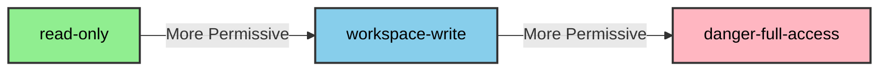
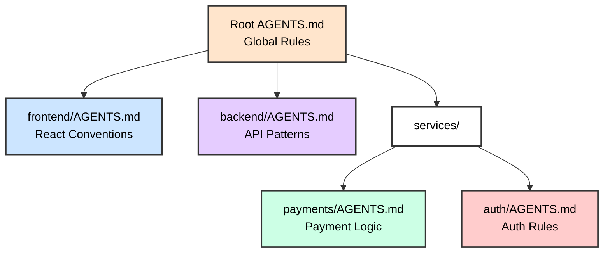
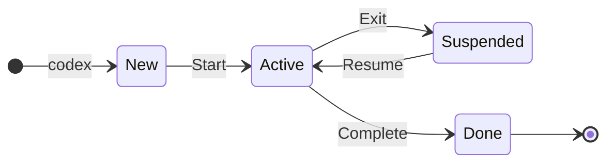
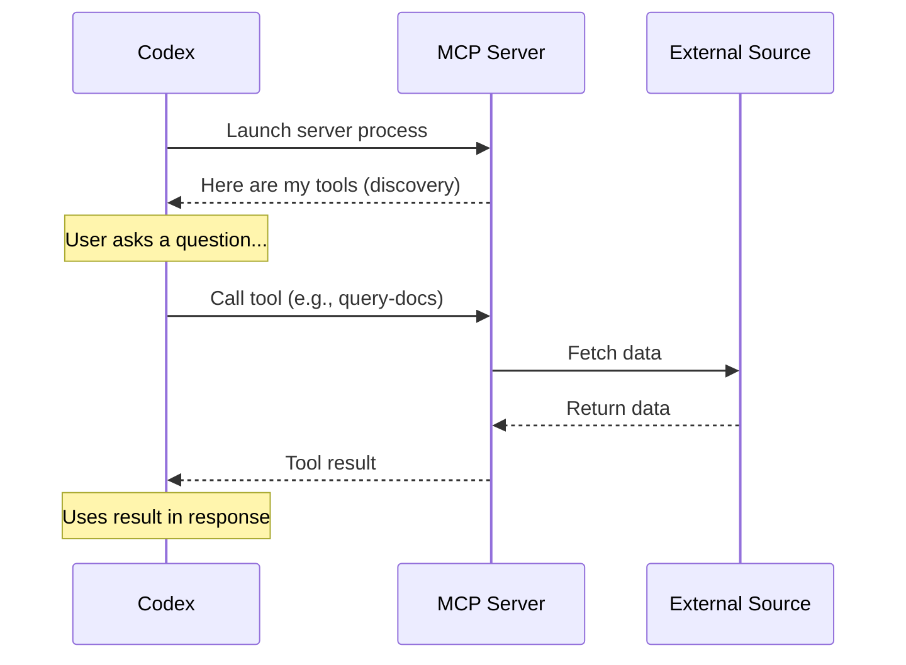
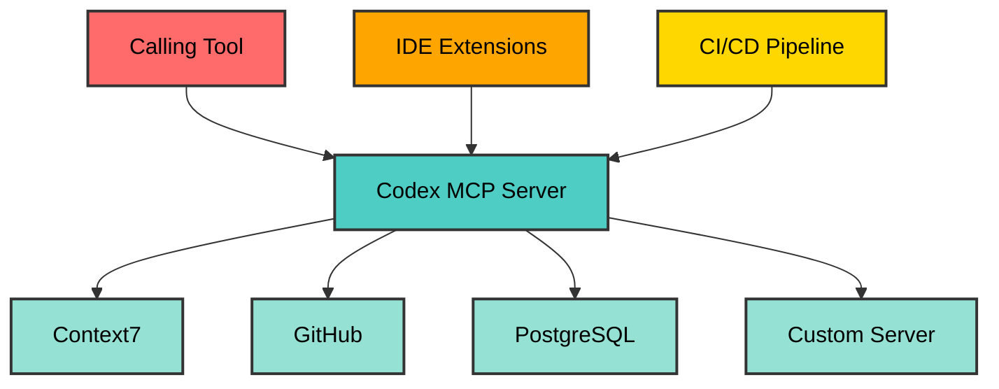

<style>
.slidev-page-num {
  display: block !important;
  opacity: 1 !important;
  visibility: visible !important;
  position: fixed !important;
  bottom: 1rem !important;
  right: 1rem !important;
  z-index: 100 !important;
  color: #666 !important;
  font-size: 0.875rem !important;
}
</style>

# OpenAI Codex Training

## AI-Powered Software Engineering Agent

<div class="pt-12">
  <span @click="$slidev.nav.next" class="px-2 py-1 rounded cursor-pointer" hover="bg-white bg-opacity-10">
    Press Space for next page <carbon:arrow-right class="inline"/>
  </span>
</div>

---

# Contact Info

Ken Kousen
Kousen IT, Inc.

- ken.kousen@kousenit.com
- http://www.kousenit.com
- http://kousenit.org (blog)
- Social Media:
  - [@kenkousen](https://twitter.com/kenkousen) (twitter)
  - [@kenkousen@foojay.social](https://foojay.social/@kenkousen) (mastodon)
  - [@kousenit.com](https://bsky.app/profile/kousenit.com) (bluesky)
- *Tales from the jar side* (free newsletter)
  - https://kenkousen.substack.com
  - https://youtube.com/@talesfromthejarside

---

# Course Overview

## 5-Hour Hands-On Workshop

<v-clicks>

- Installation and authentication strategies
- Terminal UI and navigation
- Codex app, IDE, and cloud workflows
- Sandbox modes and approval policies
- Real-world coding projects

</v-clicks>

---

# Topics We'll Cover

<v-clicks>

- Advanced TOML configuration
- **Agent Skills** - Reusable workflows
- MCP services integration
- Memory with AGENTS.md
- Custom prompts and profiles
- Model selection and local OSS options

</v-clicks>

---

# Prerequisites

<v-clicks>

- Command-line experience
- Basic programming knowledge
- Git familiarity
- Docker (for advanced exercises)

</v-clicks>

---

# What is OpenAI Codex?

## A Coding Agent Across CLI, App, IDE, and Cloud

---

# Key Features

<v-clicks>

- Frontier OpenAI models plus local OSS options
- Built-in safety with sandbox modes
- Rich configuration system
- Model Context Protocol (MCP) integration

</v-clicks>

---

# Advanced Capabilities

<v-clicks>

- Session persistence and resumption
- Custom prompts and profiles
- CI/CD compatible
- Headless execution

</v-clicks>

---

# Authentication Options

<v-clicks>

## ChatGPT Account (Recommended)
- Uses your ChatGPT account login
- Required for some Codex surfaces and model availability
- Simplified login flow

## API Key
- Direct API access
- Pay-per-use pricing
- Some Codex app/cloud features and models may not be available

</v-clicks>

---

# Model Support

<v-clicks>

- <span style="color: #00D4FF">**GPT-5.6-Sol**</span> - Current frontier default for agentic coding (272K context)
- <span style="color: #00D4FF">**GPT-5.6-Terra / Luna**</span> - Sibling variants with different trade-offs
- <span style="color: #00D4FF">**GPT-5.5 / GPT-5.4**</span> - Older models, still available
- <span style="color: #00D4FF">**GPT-5.4-mini**</span> - Fast scoped work and lighter sub-agent tasks
- Local OSS models through Ollama or LM Studio
- Use `/model` in the TUI — or `codex debug models` for the full catalog

</v-clicks>

---

# Installation Methods

```bash
# Official install script (macOS/Linux)
curl -fsSL https://chatgpt.com/codex/install.sh | sh

# NPM
npm install -g @openai/codex

# Homebrew (macOS/Linux)
brew install --cask codex

# Direct binary download
# Visit: https://github.com/openai/codex/releases
```

---

# Verify Installation

```bash
codex --version
```

---

# Configuration Locations

<v-clicks>

- **Config**: `~/.codex/config.toml`
- **Prompts**: `~/.codex/prompts/`
- **Logs**: `~/.codex/log/`

</v-clicks>

---

# ChatGPT Account Login

```bash
# Interactive login
codex login

# Device-auth login for remote servers
codex login --device-auth
```

---

# API Key Authentication

```bash
# Set environment variable
export OPENAI_API_KEY="your-key"

# Store it with Codex
printenv OPENAI_API_KEY | codex login --with-api-key
```

Do not put API keys directly in `config.toml`.

---

# Verify Authentication

```bash
codex "Hello, are you working?"
```

---

# Starting Codex

```bash
# Interactive mode (default)
codex

# With initial prompt
codex "explain this codebase"

# Execute and exit mode
codex exec "generate a README"
```

---

# Key Bindings

<v-clicks>

- `Enter` - Submit prompt
- `Ctrl+C` - Cancel current operation
- `Ctrl+D` - Exit Codex
- `Tab` - Autocomplete
- `/` - Access slash commands

</v-clicks>

---

# Slash Commands

<v-clicks>

- `/status` - Show session info & token usage
- `/diff` - Review all pending changes
- `/clear` - Clear screen or start fresh chat
- `/save` - Save current session
- `/help` - Show available commands
- `/model` - Inspect or switch active model
- `/fast` - Toggle fast/standard mode
- `/permissions` - Manage sandbox permissions
- `/review` - Review changes without editing
- `/mcp` - Inspect MCP servers
- `/skills` - Inspect available skills
- `/plugins` - Inspect installed plugins
- `/fork` and `/side` - Split work into separate threads where available

</v-clicks>

---

# /diff Command - Review Changes

```diff
--- a/src/main.py
+++ b/src/main.py
@@ -10,7 +10,9 @@ def process_data(input_file):
-    data = json.load(f)
+    with open(input_file, 'r') as f:
+        data = json.load(f)
     return data

3 files changed, 47 insertions(+), 12 deletions(-)
```

Review line-by-line before approving!

---

# /status Command

Shows comprehensive session information:

```
Current model: gpt-5.6-sol
Session ID: abc123
Token usage: 15,432 / 272,000
Cost estimate: $0.46
Time elapsed: 12m 34s
```

---

# /review Command

Launch code review without modifying your working tree:

```bash
# Review uncommitted changes
/review

# Review with specific focus
/review Check for security vulnerabilities

# Review changes against a branch
/review Compare with main branch
```

---

# Built-in Reviewers

<v-clicks>

- **Security** - OWASP patterns, injection risks
- **Performance** - N+1 queries, memory leaks
- **Style** - Naming conventions, code structure
- **Tests** - Coverage gaps, edge cases

Reviewers analyze diffs without executing code

</v-clicks>

---

# Search Your Codebase

```bash
# Fast text search with ripgrep
rg "TODO"
rg "authenticate"
rg "database connection"
```

<v-clicks>

- Respects .gitignore and runs fast on large repos
- Pipe matches into Codex for follow-up analysis
- Keep the agent focused by sharing only relevant snippets
- Great starting point for exploration and debugging

</v-clicks>

---

# Web Search Capabilities

```bash
# One-off run with live web search enabled
codex --search "latest Spring Boot validation guidance"
```

<v-clicks>

- `web_search = "cached"` uses Codex's maintained index
- `web_search = "live"` fetches current web data
- `web_search = "disabled"` keeps the session offline
- Prefer official docs for APIs, SDKs, and product behavior
- Use MCP documentation servers when they are available

</v-clicks>

---

# Using Web Search

```bash
# In interactive mode, Codex can search the web
codex
> "Search official docs for the current React Hook Form API"
> "Find Python async/await best practices"
> "What changed in Spring Boot validation docs?"
```

<v-clicks>

- Ask for current sources explicitly when accuracy matters
- Use live search for unstable or recent information
- Use cached or disabled search for reproducible coding work

</v-clicks>

---

# Image Inputs

Attach screenshots and design specs for visual context:

```bash
# From command line
codex -i screenshot.png "Explain this error"
codex -i mockup.png "Implement this design"
codex -i diagram.png "Generate code for this architecture"

# Multiple images
codex -i error.png -i logs.png "Debug this issue"
```

---

# Image Input Use Cases

<v-clicks>

- **Debug UI errors** - Share error dialogs, stack traces
- **Implement designs** - Convert mockups to code
- **Analyze diagrams** - Generate from architecture docs
- **Review screenshots** - Identify accessibility issues
- **Compare outputs** - "Why does this look different?"

Paste images directly in the TUI composer!

</v-clicks>

---
layout: image-right
image: https://images.unsplash.com/photo-1555949963-ff9fe0c870eb?ixlib=rb-4.0.3&auto=format&fit=crop&w=1920&q=80
backgroundSize: cover
---

# Core Features

<div class="text-center mt-20">
  <h2 class="text-4xl font-bold text-white bg-black bg-opacity-60 px-6 py-3 rounded-lg">
    Essential Capabilities
  </h2>
  <p class="text-xl text-white bg-black bg-opacity-60 px-4 py-2 rounded mt-4">
    Master the fundamentals
  </p>
</div>

---

# Sandbox Modes


```mermaid
graph LR
    A[read-only] -->|More Permissive| B[workspace-write]
    B -->|More Permissive| C[danger-full-access]

    A:::safe
    B:::default
    C:::danger

    classDef safe fill:#90EE90,stroke:#333,stroke-width:2px,color:#000
    classDef default fill:#87CEEB,stroke:#333,stroke-width:2px,color:#000
    classDef danger fill:#FFB6C1,stroke:#333,stroke-width:2px,color:#000
```

<v-clicks>

- **read-only** - No file modifications
- **workspace-write** - Default; writes limited to the workspace
- **danger-full-access** - No sandboxing (use carefully!)

</v-clicks>

---

# Approval Policies

<v-clicks>

- **on-request** - Approve risky actions (the interactive default)
- **never** - No approval prompts; best for narrow, non-interactive tasks
- Config also accepts **on-failure** (failures return straight to the model)
- `untrusted` was retired in 0.149 — configs still setting it refuse to load

</v-clicks>

---

# Setting Safety Options

```bash
# Set sandbox mode
codex --sandbox read-only

# Set approval policy (equivalent to approval_policy in config)
codex --ask-for-approval on-request

# Full access only inside an external sandbox you trust
codex --sandbox danger-full-access --ask-for-approval on-request
```

CLI flags override config file settings for the session.

---

# Project Memory: AGENTS.md

## Automatic Context Loading

<v-clicks>

- Place <span style="color: #00D4FF">`AGENTS.md`</span> in project root
- Loaded automatically with first prompt
- Configurable size limit (default: 32KB)

</v-clicks>

---

# Example AGENTS.md

```markdown
# Project: E-Commerce Platform

## Tech Stack
- Backend: Node.js + Express
- Database: PostgreSQL
- Frontend: React + TypeScript
```

---

# AGENTS.md Best Practices

```markdown
## Conventions
- Use async/await for all async operations
- Follow RESTful API patterns
- Write tests for all new features

## Current Focus
Working on payment integration with Stripe
```

---

# Hierarchical AGENTS.md


```mermaid
graph TD
    A[Root AGENTS.md<br/>Global Rules] --> B[frontend/AGENTS.md<br/>React Conventions]
    A --> C[backend/AGENTS.md<br/>API Patterns]
    A --> D[services/]
    D --> E[payments/AGENTS.md<br/>Payment Logic]
    D --> F[auth/AGENTS.md<br/>Auth Rules]

    style A fill:#FFE5CC,stroke:#333,stroke-width:2px,color:#000
    style B fill:#CCE5FF,stroke:#333,stroke-width:2px,color:#000
    style C fill:#E5CCFF,stroke:#333,stroke-width:2px,color:#000
    style D fill:#FFF,stroke:#333,stroke-width:2px,color:#000
    style E fill:#CCFFE5,stroke:#333,stroke-width:2px,color:#000
    style F fill:#FFCCCC,stroke:#333,stroke-width:2px,color:#000
```

Codex reads guidance from the project root down to the current directory.
Closer files override earlier guidance when instructions conflict.

---

# Context Cascade Benefits

<v-clicks>

- Global rules apply everywhere
- Subfolder rules override parent
- `AGENTS.override.md` takes precedence over `AGENTS.md` in the same directory
- Each team owns their conventions
- Frontend/backend stay independent
- Microservices maintain autonomy

</v-clicks>

---

# Custom Prompts

## Creating Custom Prompts

<v-clicks>

1. Create `.md` file in `~/.codex/prompts/`
2. Access via slash commands
3. Reusable across projects

</v-clicks>

---

# Example Custom Prompt

```markdown
# ~/.codex/prompts/refactor.md
Refactor the selected code following these principles:
1. Extract complex logic into small functions
2. Use meaningful variable names
3. Add appropriate error handling
```

---

# Prompt Library Highlights

<v-clicks>

- Prebuilt prompts live in `~/.codex/prompts/` (see repo `prompts/README.md`)
- Core templates: `refactor`, `security-audit`, `test-gen`, `pr-review`, `api-upgrade`, `perf-fix`
- Customize or fork them for your team’s workflow and slash commands

</v-clicks>

```bash
/refactor
/security-audit
/test-gen
/pr-review
/api-upgrade
/perf-fix
```

---

# Prompt Arguments Workaround

<v-clicks>

- Custom prompts are static markdown files
- Solution: Use shell scripts as wrappers
- Scripts can accept parameters and build dynamic prompts
- Store in <span style="color: #00D4FF">`~/.codex/scripts/`</span> for reuse

</v-clicks>

---

# Prompt Arguments: Implementation

```bash
#!/bin/bash
# ~/.codex/scripts/review-file.sh

FILE=$1
FOCUS=$2

cat > /tmp/review-prompt.md << EOF
Review the file ${FILE} focusing on ${FOCUS}:
- Check for bugs and errors
- Suggest improvements
- Rate code quality
EOF

codex exec "$(cat /tmp/review-prompt.md)"
```

Usage: `./review-file.sh UserService.java security`

---
layout: image-right
image: https://images.unsplash.com/photo-1558494949-ef010cbdcc31?ixlib=rb-4.0.3&auto=format&fit=crop&w=1920&q=80
backgroundSize: cover
---

# Agent Skills

<div class="mt-20">
  <h2 class="text-4xl font-bold text-white bg-black bg-opacity-60 px-6 py-3 rounded-lg">
    Reusable Workflows
  </h2>
  <p class="text-xl text-white bg-black bg-opacity-60 px-4 py-2 rounded mt-4">
    Instructions, scripts, references, and assets
  </p>
</div>

---

# What Are Agent Skills?

<v-clicks>

- **Reusable instruction bundles** with optional scripts and resources
- **Authoring format** for workflows Codex can discover and invoke
- **Progressive loading**: Only name/description loaded at startup
- **Two invocation modes**: Explicit (<span style="color: #00D4FF">`$skill-name`</span>) or implicit (auto-detect)
- **Plugins** are the installable distribution unit for shared capabilities
- Managed from the CLI: `codex plugin add|list|remove` and `codex plugin marketplace add|list|upgrade`

</v-clicks>

---

# Skill Locations

<v-clicks>

| Scope | Location | Use Case |
|-------|----------|----------|
| **Repository** | <span style="color: #00D4FF">`.agents/skills/`</span> | Team-shared skills |
| **User** | <span style="color: #00D4FF">`~/.agents/skills/`</span> | Personal workflows |
| **Admin** | System-managed | Enterprise policies |
| **System** | Bundled with Codex | Built-in workflows |

Repo skills are discovered from the current directory up to the repo root.

</v-clicks>

---

# Skill Structure

```
my-skill/
├── SKILL.md          # Required: YAML frontmatter + instructions
├── agents/
│   └── openai.yaml   # Optional: metadata, deps, invocation policy
├── scripts/          # Optional: executable code
├── references/       # Optional: documentation
└── assets/           # Optional: templates, resources
```

---

# SKILL.md Format

```yaml
---
name: security-review
description: >
  Perform security analysis. Use when asked about vulnerabilities,
  security audit, or "is this code secure".
---

# Security Review

Analyze codebases for security vulnerabilities...

## Workflow
1. Reconnaissance - identify tech stack
2. Dependency analysis - check for CVEs
3. Code analysis - scan for patterns
4. Generate report - create SECURITY_REVIEW.md
```

---

# Invoking Skills

## Explicit Invocation

```bash
# Use $ prefix to invoke directly
$skill-creator Create a skill for commit messages
$create-plan Design a new authentication system
```

## Implicit Invocation

```bash
# Codex auto-selects based on task match
"Review this code for security vulnerabilities"
# → Automatically invokes security-review skill if installed
```

---

# Built-in Skills

<v-clicks>

- <span style="color: #00D4FF">**$skill-creator**</span> - Bootstrap new skills from description
- <span style="color: #00D4FF">**$skill-installer**</span> - Install skills from catalog
- Additional skills depend on your local installation and plugins

Install additional skills:
```bash
$skill-installer linear    # Linear integration
$skill-installer notion    # Notion integration
```

</v-clicks>

---

# Creating a Skill

```bash
# Use the built-in skill creator
$skill-creator Create a skill that generates
conventional commit messages based on staged changes
```

Codex will:
1. Create the skill folder structure
2. Generate SKILL.md with appropriate metadata
3. Add workflow instructions
4. Suggest reference files if needed

---

# Skills vs Prompts

| Aspect | Custom Prompts | Agent Skills |
|--------|---------------|--------------|
| **Location** | `~/.codex/prompts/` | `~/.agents/skills/` |
| **Structure** | Single `.md` file | Folder with resources |
| **Invocation** | Slash commands | `$skill-name` or auto |
| **Resources** | Text only | Scripts, templates, refs |
| **Sharing** | Copy files | Git-friendly folders |

**Recommendation**: Use Skills for complex, multi-step workflows

---

# Skill Discovery in Practice

<v-clicks>

- Keep the `description` specific and action-oriented
- Use `$skill-name` when you want to force a skill
- Let implicit invocation handle repeated workflow matches
- Put large examples in `references/`, not `SKILL.md`
- Put deterministic helpers in `scripts/`

</v-clicks>

---

# Configuration Profiles

## One File per Profile (since 0.134)

Each profile is its own file — `~/.codex/<name>.config.toml` — with **top-level keys**, layered over `config.toml`:

```toml
# ~/.codex/production.config.toml
model = "gpt-5.6-sol"
approval_policy = "on-request"
sandbox_mode = "workspace-write"
```

```toml
# ~/.codex/quick.config.toml
model = "gpt-5.4-mini"
approval_policy = "never"
sandbox_mode = "read-only"
```

⚠️ Old-style `[profiles.*]` tables inside `config.toml` make the CLI **refuse to start** — if you configured profiles before 0.134, move them out.

---

# Using Profiles

```bash
codex --profile production
codex --profile quick

# Catch stale or misspelled config keys early
codex --strict-config
```

---

# Resume Previous Sessions

```bash
# Open picker to choose a session
codex resume

# Resume the most recent session automatically
codex resume --last

# Resume a specific session by id
codex resume SESSION_ID
```

---

# Session Lifecycle


```mermaid
stateDiagram-v2
    direction LR
    [*] --> New: codex
    New --> Active: Start
    Active --> Suspended: Exit
    Suspended --> Active: Resume
    Active --> Done: Complete
    Done --> [*]
```

**Commands**: `codex`, `codex resume`, `codex apply`

---

# Session Commands

```bash
# Interactive session picker
codex resume

# Jump straight to the most recent session
codex resume --last

# Apply the last diff from the active session
codex apply
```

---

# Non-Interactive Sessions

```bash
# Run in CI/CD pipeline
codex exec "update dependencies and fix breaking changes"

# Note: For resuming, use the regular command
codex resume
```

---
layout: image-right
image: https://images.unsplash.com/photo-1488590528505-98d2b5aba04b?ixlib=rb-4.0.3&auto=format&fit=crop&w=1920&q=80
backgroundSize: cover
---

# Advanced Features

<div class="mt-20">
  <h2 class="text-4xl font-bold text-white bg-black bg-opacity-60 px-6 py-3 rounded-lg">
    Power User Tools
  </h2>
  <p class="text-xl text-white bg-black bg-opacity-60 px-4 py-2 rounded mt-4">
    Unlock full potential
  </p>
</div>

---

# Codex Cloud

Run long tasks without tying up your terminal:

```bash
# Launch a cloud task
codex cloud exec "Refactor authentication module"

# Check task status
codex cloud status

# List running tasks
codex cloud list

# Inspect and apply results
codex cloud diff
codex cloud apply
```

---

# Codex Cloud Benefits

<v-clicks>

- **Background execution** - Free up your terminal
- **Parallel tasks** - Run multiple jobs simultaneously
- **Persistent environments** - Pre-configured workspaces
- **Team collaboration** - Share environments and results
- **Long-running jobs** - Multi-hour refactoring sessions

</v-clicks>

---

# IDE Extensions

<v-clicks>

Codex integrates with popular IDEs:

- **VS Code** - Full extension in marketplace
- **Cursor** - Native Codex support
- **Windsurf** - Integrated workflows

All extensions support:
- Skills and MCP servers
- Project-local configuration
- Same approval policies as CLI

</v-clicks>

---
layout: image-right
image: https://images.unsplash.com/photo-1451187580459-43490279c0fa?ixlib=rb-4.0.3&auto=format&fit=crop&w=1920&q=80
backgroundSize: cover
---

# Model Context Protocol

<div class="mt-20">
  <h2 class="text-4xl font-bold text-white bg-black bg-opacity-60 px-6 py-3 rounded-lg">
    MCP Integration
  </h2>
  <p class="text-xl text-white bg-black bg-opacity-60 px-4 py-2 rounded mt-4">
    Extend Codex with external tools and data
  </p>
</div>

---

# What Is MCP?

An open protocol that connects AI tools to external data sources and services.

<v-clicks>

- **Problem**: LLMs only know what's in their training data
- **Solution**: MCP lets them call external tools at runtime
- **Analogy**: Like USB for AI — a standard way to plug in capabilities
- **Adopted by**: Codex, Claude Code, Cursor, VS Code, and others

</v-clicks>

---

# How MCP Works


```mermaid
sequenceDiagram
    participant Codex
    participant Server as MCP Server
    participant Source as External Source

    Codex->>Server: Launch server process
    Server-->>Codex: Here are my tools (discovery)
    Note over Codex: User asks a question...
    Codex->>Server: Call tool (e.g., query-docs)
    Server->>Source: Fetch data
    Source-->>Server: Return data
    Server-->>Codex: Tool result
    Note over Codex: Uses result in response
```

---

# MCP Concepts

| Concept | Description |
|---------|-------------|
| **Server** | A process that exposes tools (runs locally or remotely) |
| **Tool** | A function the server provides (e.g., "query-docs") |
| **Transport** | How Codex talks to the server: **stdio** (local) or **HTTP** (remote) |
| **Discovery** | On startup, Codex asks each server what tools it has |
| **Invocation** | During a conversation, Codex calls tools when relevant |

---

# Two Transport Types

### stdio (Local Process)

Codex launches the server as a child process; they communicate over stdin/stdout.

```toml
[mcp_servers.context7]
command = "npx"
args = ["-y", "@upstash/context7-mcp"]
```

### HTTP (Remote Server)

Codex connects to a running server over the network.

```toml
[mcp_servers.context7-remote]
url = "https://mcp.context7.com/mcp"
# If auth is required:
# bearer_token_env_var = "CONTEXT7_API_KEY"
```

---

# Adding MCP Servers to Codex

### CLI Command (Recommended)

```bash
codex mcp add context7 -- npx -y @upstash/context7-mcp
```

### Verify

```bash
codex mcp list
```

### Remove

```bash
codex mcp remove context7
```

---

# Configuration in config.toml

The `codex mcp add` command writes to `~/.codex/config.toml`:

```toml
[mcp_servers.context7]
command = "npx"
args = ["-y", "@upstash/context7-mcp"]
```

### Optional Settings

```toml
[mcp_servers.context7]
command = "npx"
args = ["-y", "@upstash/context7-mcp"]
startup_timeout_sec = 15   # Abort if server takes too long to start
tool_timeout_sec = 30      # Abort if a tool call takes too long
enabled = true             # Toggle without removing config
```

---

# User-Level vs Project-Level

### User-Level (default)

Available in all projects. Stored in `~/.codex/config.toml`.

```bash
codex mcp add context7 -- npx -y @upstash/context7-mcp
```

### Project-Level

Only available in this project. Stored in `.codex/config.toml`.

```toml
[mcp_servers.context7]
command = "npx"
args = ["-y", "@upstash/context7-mcp"]
startup_timeout_sec = 20
tool_timeout_sec = 60
```

Project-level is useful when a server is specific to one codebase (e.g., a database server for that project's schema).

---

# Context7: Live Documentation

Context7 is an MCP server that fetches up-to-date library documentation.

<v-clicks>

- **Two tools**: `resolve-library-id` and `query-docs`
- **Thousands of libraries**: React, Spring Boot, Zod, pytest, and more
- **Authentication optional in many setups**: Use environment variables if your setup requires a key
- **Why it matters**: Codex uses current APIs instead of stale training data

</v-clicks>

---

# Context7 in Action

### Without Context7

```
Create a Zod schema for a registration form
```

Codex relies on training data — might use outdated syntax.

### With Context7

```
Use context7 to look up the current Zod docs, then create
a registration form schema with email and password validation
```

Codex fetches live Zod documentation first, then writes code using the current API.

---

# More MCP Server Examples

### GitHub

```toml
[mcp_servers.github]
command = "npx"
args = ["@modelcontextprotocol/server-github"]
env = { GITHUB_TOKEN = "${GITHUB_TOKEN}" }
```

### PostgreSQL

```toml
[mcp_servers.postgres]
command = "npx"
args = ["@modelcontextprotocol/server-postgres"]
env = { CONNECTION_STRING = "${DATABASE_URL}" }
```

---

# MCP Startup Guardrails

Prevent flaky servers from freezing Codex:

```toml
[mcp_servers.github]
command = "npx"
args = ["@modelcontextprotocol/server-github"]
startup_timeout_sec = 15  # Abort after 15 seconds
```

<v-clicks>

- Clean abort when servers fail to boot
- Prevents entire session from freezing
- Clear error messages on configuration issues

</v-clicks>

---

# Running Codex as an MCP Server

Codex itself can be exposed as an MCP server for other tools:

```bash
codex mcp-server    # reads ~/.codex/config.toml automatically
```

⚠️ Deprecated in 0.149 — it still works but prints a warning; the successor isn't named yet (watch `codex app-server`).

### Use Cases

<v-clicks>

- IDEs can integrate without plugins
- CI/CD pipelines can invoke Codex workflows
- Other agent tools can call Codex through MCP
- Shared tools can route specialized coding tasks to Codex

</v-clicks>

---

# Codex as an MCP Tool

```bash
# Start Codex's MCP server (deprecated in 0.149; still works, warns)
codex mcp-server

# Configure the calling tool with that command
```

<v-clicks>

- The caller gets Codex tools through MCP
- Codex still applies its sandbox and approval policies
- Useful when one tool needs Codex as a specialized coding sub-agent

</v-clicks>

---

# MCP Architecture


```mermaid
flowchart TB
    TOOL[Calling Tool] --> CM[Codex MCP Server]
    IDE[IDE Extensions] --> CM
    CI[CI/CD Pipeline] --> CM

    CM --> C7[Context7]
    CM --> GH[GitHub]
    CM --> PG[PostgreSQL]
    CM --> Custom[Custom Server]

    style TOOL fill:#FF6B6B,stroke:#333,stroke-width:2px,color:#000
    style CM fill:#4ECDC4,stroke:#333,stroke-width:2px,color:#000
    style IDE fill:#FFA500,stroke:#333,stroke-width:2px,color:#000
    style CI fill:#FFD700,stroke:#333,stroke-width:2px,color:#000
    style C7 fill:#95E1D3,stroke:#333,stroke-width:2px,color:#000
    style GH fill:#95E1D3,stroke:#333,stroke-width:2px,color:#000
    style PG fill:#95E1D3,stroke:#333,stroke-width:2px,color:#000
    style Custom fill:#95E1D3,stroke:#333,stroke-width:2px,color:#000
```

---
layout: image-right
image: https://images.unsplash.com/photo-1620712943543-bcc4688e7485?ixlib=rb-4.0.3&auto=format&fit=crop&w=1920&q=80
backgroundSize: cover
---

# Model Flexibility

<div class="mt-20">
  <h2 class="text-4xl font-bold text-white bg-black bg-opacity-60 px-6 py-3 rounded-lg">
    Hosted and Local Options
  </h2>
  <p class="text-xl text-white bg-black bg-opacity-60 px-4 py-2 rounded mt-4">
    OpenAI models, local OSS, and profiles
  </p>
</div>

---

# Model Profiles

## Match the model to the work

---

# Recommended OpenAI Profiles

```toml
# ~/.codex/quick.config.toml
model = "gpt-5.4-mini"
model_reasoning_effort = "low"
```

```toml
# ~/.codex/standard.config.toml
model = "gpt-5.6-sol"
model_reasoning_effort = "medium"
```

```toml
# ~/.codex/thorough.config.toml
model = "gpt-5.6-sol"
model_reasoning_effort = "high"
```

---

# Local OSS Models

```bash
codex --oss --local-provider ollama
codex --oss --local-provider lmstudio
```

```toml
# ~/.codex/local.config.toml
model_provider = "ollama"
model = "qwen2.5-coder:32b"
sandbox_mode = "workspace-write"
approval_policy = "on-request"
```

---

# Switch Models

```bash
codex --model gpt-5.6-sol
codex --model gpt-5.4-mini
codex --profile thorough

# What can my account use?
codex debug models
```

---

# Enable Detailed Logging

```bash
# Set log level
export RUST_LOG=debug
codex

# Trace level (maximum detail)
export RUST_LOG=trace
codex
```

---

# Log Locations

<v-clicks>

- Interactive: `~/.codex/log/codex-tui.log`
- Non-interactive: stderr output
- Custom: Redirect with shell operators

</v-clicks>

---

# Debug Configuration

```bash
# Session-level debug output
RUST_LOG=debug codex

# Trace-level output for MCP startup issues
RUST_LOG=trace codex
```

---

# CI/CD & Automation

<v-clicks>

- GitHub Actions example lives in repo (<span style="color: #00D4FF">`.github/workflows/codex-review.yml`</span>)
- Typical steps: checkout → install Codex → authenticate → <span style="color: #00D4FF">`codex exec`</span> → upload artifacts
- Cron ideas: weekly security sweep, dependency refresh, monthly cleanup
- Guardrails: run on branches, review PRs before merge, notify on failures

</v-clicks>

---

# CI/CD Pipeline Examples

```bash
# Fail-fast pipeline
git pull && \
codex exec "migrate database schema" && \
npm test
```

```bash
# Weekly cron example
0 2 * * 1 cd /path/to/repo && \
  codex exec "weekly security audit"
```

```bash
# Chain commands to stop on failure
npm install && \
codex exec "fix any TypeScript errors" && \
npm run build
```

---

# Advanced TOML Configuration

```toml
# ~/.codex/config.toml
model = "gpt-5.6-sol"
model_provider = "openai"
approval_policy = "on-request"
sandbox_mode = "workspace-write"
web_search = "cached"
model_reasoning_effort = "medium"
```

---

# Environment & Notifications

```toml
notify = ["notify-send", "Codex", "Task completed"]

[shell_environment_policy]
inherit = "core"
exclude = ["OPENAI_API_KEY", "GITHUB_TOKEN"]

[shell_environment_policy.set]
NODE_ENV = "development"
```

---

# Shell Environment Policies

<v-clicks>

- **all** - Inherit the parent shell environment
- **core** - Inherit the minimal useful shell environment
- **none** - Start from an empty environment, then add explicit variables

</v-clicks>

---

# Environment Configuration

```toml
[shell_environment_policy]
inherit = "core"
exclude = ["AWS_SECRET_ACCESS_KEY", "OPENAI_API_KEY"]

[shell_environment_policy.set]
LANG = "en_US.UTF-8"
```

---

# Explicit Environment Additions

```toml
[shell_environment_policy.set]
PATH = "/usr/local/bin:/usr/bin:/bin"
NODE_ENV = "development"
RUST_LOG = "warn"
```

---

# Security Considerations

<v-clicks>

- Use `inherit = "none"` for tightly controlled automation
- Use `inherit = "core"` for most local development
- Never expose secrets in config

</v-clicks>

---

# Notification Options

<v-clicks>

- Notifications use the top-level `notify = [...]` command
- Codex passes a JSON payload to the command on stdin
- Keep secrets in environment variables, not command arguments

</v-clicks>

---

# Enterprise Features

<v-clicks>

- **MDM Configuration** - Managed settings on macOS via MDM profiles
- **Admin-scoped Skills** - Organization-wide skill deployment
- **Requirements.toml** - Enforce policies across teams
- **Zero Data Retention** - ZDR compliance with ChatGPT auth
- **Audit Logging** - Track all agent actions

</v-clicks>

---

# Requirements.toml

Enforce organizational policies:

```toml
# /etc/codex/requirements.toml (UNIX)
# or via MDM (macOS)

[sandbox]
allowed_sandbox_modes = ["read-only", "workspace-write"]
# Prevents danger-full-access

[skills]
admin_only = ["deploy-prod", "db-migrate"]

[approval]
allowed_approval_policies = ["on-request"]

[web_search]
allowed_web_search_modes = ["disabled", "cached"]
```

---

# Prompt Engineering Tips

<v-clicks>

## When to Use Each Mode

| Mode | Use Case |
|------|----------|
| Interactive (`codex`) | Exploration, iteration, learning |
| Single prompt (`codex "..."`) | Quick questions, small tasks |
| Exec (`codex exec`) | Automation, CI/CD, scripts |

</v-clicks>

---

# Effective Prompts

<v-clicks>

**Be specific about scope:**
- ❌ "Fix the bugs"
- ✅ "Fix the null pointer exception in UserService.java line 42"

**Provide context:**
- ❌ "Add tests"
- ✅ "Add unit tests for the validateEmail function using Jest"

**State expected outcomes:**
- ❌ "Make it faster"
- ✅ "Optimize the database query to reduce response time below 100ms"

</v-clicks>

---

# AGENTS.md Best Practices

<v-clicks>

Keep it focused and current:

```markdown
# Project Context
E-commerce platform, Node.js + PostgreSQL

## Current Sprint
Payment integration with Stripe

## Conventions
- Use async/await, not callbacks
- All API responses follow { data, error } format
- Tests required for all new endpoints
```

Update AGENTS.md as your project evolves!

</v-clicks>

---
layout: image-left
image: https://images.unsplash.com/photo-1498050108023-c5249f4df085?ixlib=rb-4.0.3&auto=format&fit=crop&w=1920&q=80
backgroundSize: cover
---

# Practical Exercises

<div class="mt-20">
  <h2 class="text-4xl font-bold text-white bg-black bg-opacity-70 px-6 py-3 rounded-lg">
    Hands-On Labs
  </h2>
  <p class="text-xl text-white bg-black bg-opacity-70 px-4 py-2 rounded mt-4">
    Learn by doing
  </p>
</div>

---

# Exercise Structure

## Three Main Categories

---

# Available Labs

<v-clicks>

- **Lab 0**: Planning and Steering Warm-Up (15 min)
- **Lab 1**: Spring Boot REST API (generate from scratch)
- **Lab 2**: Python Refactoring (improve legacy code)
- **Lab 3**: React TypeScript Forms (frontend development)
- **Lab 4**: Microservices Architecture (multi-language)
- **Lab 5**: Skills Creation (extend Codex)
- **Lab 6**: MCP Servers with Context7 (connect external data)

</v-clicks>

---

# Each Exercise Includes

<v-clicks>

- Starter code (where applicable)
- Step-by-step Codex prompts
- Success criteria checklist
- Advanced challenges

</v-clicks>

Note: You build the solution using Codex—no reference implementations provided!

---

# Lab 0: Planning and Steering Warm-Up

<v-clicks>

- Objective: Practice planning, steering, permissions, and review commands
- Timebox: 15–20 minutes
- Workspace: `exercises/plan-mode-warmup`
- Fix bugs in a small Python module while learning the interaction model
- Practice `/status`, `/permissions`, `/diff`, `/model`, `/review`

</v-clicks>

---

# Lab 1: Spring Boot API

<v-clicks>

- Objective: Build a Spring Boot 3 task-management REST API end-to-end
- Timebox: 60–90 minutes
- Workspace: `exercises/java-spring-boot`
- Instructions: open `exercises/java-spring-boot/README.md`

</v-clicks>

---

# Lab 2: Python Refactoring

<v-clicks>

- Objective: Modernize legacy Python code with clean architecture and tests
- Timebox: 45–60 minutes
- Workspace: `exercises/python-refactoring`
- Instructions: open `exercises/python-refactoring/README.md`

</v-clicks>

---

# Lab 3: React TypeScript Forms

<v-clicks>

- Objective: Ship a production-ready registration flow with React, TypeScript, and Zod
- Timebox: 45–60 minutes
- Workspace: `exercises/react-forms`
- Instructions: open `exercises/react-forms/README.md`

</v-clicks>

---

# Lab 4: Microservices

<v-clicks>

- Objective: Build an event-driven multi-language microservices system
- Timebox: 90–120 minutes
- Workspace: `exercises/microservices`
- Instructions: open `exercises/microservices/README.md`

</v-clicks>

---

# Lab 5: Skills Creation

<v-clicks>

- Objective: Create a custom skill using `$skill-creator`
- Timebox: 30 minutes
- Task: Build a skill that generates conventional commit messages
- Workspace: `exercises/skills-creation/`
- Instructions: open `exercises/skills-creation/README.md`

</v-clicks>

---

# Lab 6: MCP Servers with Context7

<v-clicks>

- Objective: Configure an MCP server and use live documentation in prompts
- Timebox: 15–20 minutes
- Pre-req: Node.js 18+ and internet access
- Workspace: `exercises/mcp-context7/` (then apply to `exercises/react-forms/`)
- Instructions: open `exercises/mcp-context7/README.md`

</v-clicks>

---

# Optional: Advanced Challenges

<v-clicks>

- **Database Migration**: Use Codex + MCP tools to modernize a legacy schema
- **AI Code Review**: Automate PR reviews using `.github/workflows/codex-review.yml`
- **Full-Stack Capstone**: Combine Labs 1-4 into a production-style application

These build on the core labs and can be explored as time permits.

</v-clicks>

---
layout: image-right
image: https://images.unsplash.com/photo-1516321318423-f06f85e504b3?ixlib=rb-4.0.3&auto=format&fit=crop&w=1920&q=80
backgroundSize: cover
---

# Best Practices

<div class="text-center mt-20">
  <h2 class="text-4xl font-bold text-white bg-black bg-opacity-60 px-6 py-3 rounded-lg">
    Professional Workflows
  </h2>
  <p class="text-xl text-white bg-black bg-opacity-60 px-4 py-2 rounded mt-4">
    Enterprise-ready patterns
  </p>
</div>

---

# Review Changes Before Approving

<v-clicks>

- Codex displays unified diffs automatically
- Use `/diff` to see all pending changes
- Review line-by-line for unintended edits
- Check file statistics (insertions/deletions)
- Catch mistakes before they land in codebase

</v-clicks>

**Pro tip:** Always review diffs for:
- Accidental deletions
- Unrelated file changes
- Security implications

---

# Security Best Practices

## Sandbox Configuration by Environment

---

# Development Profile

```toml
# ~/.codex/dev.config.toml
sandbox_mode = "workspace-write"
approval_policy = "on-request"
```

---

# Staging Profile

```toml
# ~/.codex/staging.config.toml
sandbox_mode = "workspace-write"
approval_policy = "on-request"
```

---

# Production Profile

```toml
# ~/.codex/prod.config.toml
sandbox_mode = "read-only"
approval_policy = "on-request"
```

---

# Security Guidelines

<v-clicks>

- Never store API keys in config files
- Use environment variables for secrets
- Use `read-only` for reviews and audits
- Enable approval for risky actions
- Regular audit of generated code
- Restrict network access in sandbox

</v-clicks>

---

# Team Collaboration

## Shared Configuration

---

# Project AGENTS.md

```markdown
# Team: Platform Engineering
## Conventions
- PR reviews required for all changes
- Follow company style guide
- Security scanning mandatory
- 80% test coverage minimum
```

---

# Current Sprint Context

```markdown
## Current Sprint
- Migrating to Kubernetes
- Implementing OAuth 2.0
```

---

# Shared Prompts Repository

```bash
# Clone team prompts
git clone team-repo/codex-prompts ~/.codex/prompts

# Keep synchronized
cd ~/.codex/prompts && git pull
```

---

# Model Selection Strategy

```toml
# ~/.codex/quick.config.toml
model = "gpt-5.4-mini"    # Fast scoped work
```

```toml
# ~/.codex/complex.config.toml
model = "gpt-5.6-sol"     # Complex reasoning
```

---

# Local Models

```toml
# ~/.codex/local.config.toml
model_provider = "ollama"
model = "qwen2.5-coder:32b"  # Local model availability varies
```

---

# Optimization Tips

<v-clicks>

- Use GPT-5.4-mini for simple tasks
- Cache responses with session resumption
- Batch similar operations
- Use local models for sensitive data

</v-clicks>

---
layout: image-right
image: https://images.unsplash.com/photo-1581091226825-a6a2a5aee158?ixlib=rb-4.0.3&auto=format&fit=crop&w=1920&q=80
backgroundSize: cover
---

# Troubleshooting

<div class="mt-20">
  <h2 class="text-4xl font-bold text-white bg-black bg-opacity-60 px-6 py-3 rounded-lg">
    Common Issues
  </h2>
  <p class="text-xl text-white bg-black bg-opacity-60 px-4 py-2 rounded mt-4">
    Solutions and workarounds
  </p>
</div>

---

# Troubleshooting Guide

## Common Issues & Solutions

---

# Authentication Failures

```bash
# Clear cached credentials
rm -rf ~/.codex/auth

# Re-authenticate
codex login --device-auth
```

---

# Sandbox Errors

```bash
# Confirm sandbox configuration
grep sandbox_mode ~/.codex/config.toml

# If the workspace is intentionally disposable
codex --sandbox danger-full-access --ask-for-approval on-request
```

---

# MCP Connection Issues

```bash
# Test MCP server
npx @modelcontextprotocol/server-test

# Enable debug logging
RUST_LOG=trace codex
```

---

# Context Limit Errors

<v-clicks>

**Symptoms**: "Context window exceeded", slow responses

**Solutions**:
- Start a new session: `/clear` or new terminal
- Use `codex resume` to continue with trimmed context
- Break large tasks into smaller prompts
- Remove verbose files from AGENTS.md

</v-clicks>

---

# Model Availability Issues

```bash
# In the TUI, use /model to inspect or switch models

# Pick an explicit model from your catalog (codex debug models)
codex --model gpt-5.6-sol

# Verify API connectivity
curl -I https://api.openai.com/v1/models
```

---

# Common Error Messages

| Error | Cause | Fix |
|-------|-------|-----|
| "Token expired" | Auth timeout | `codex login` again |
| "Rate limited" | Too many requests | Wait or use smaller model |
| "No such table" | Wrong osquery platform | Check platform docs |
| "Sandbox denied" | Permission blocked | Adjust sandbox mode |

---

# VS Code Integration

```json
{
  "tasks": [{
    "label": "Codex Review",
    "type": "shell",
    "command": "codex exec 'Review ${file} for issues'"
  }]
}
```

---

# Git Hooks

```bash
#!/bin/bash
# .git/hooks/pre-commit
codex exec -p quick -s read-only \
  "Check staged files for security issues"
```

(`codex exec` is the non-interactive entry point — there is no `-n` flag; `quick` is the read-only profile from the config examples.)

---

# Make Integration

```makefile
review:
	codex exec "Review all changes since last commit"

generate-tests:
	codex exec "Generate missing unit tests"
```

---

# Diagnostics Workflow

<v-clicks>

- Reproduce with a narrow prompt
- Run with `RUST_LOG=debug` or `RUST_LOG=trace`
- Inspect `~/.codex/log/`
- Disable optional MCP servers if startup is flaky
- Capture command, model, sandbox, approval policy, and error text

</v-clicks>

---

# Log Analysis

```bash
# Filter JSON logs for errors
cat ~/.codex/log/codex-tui.log | jq 'select(.level == "error")'

# Monitor in real-time
tail -f ~/.codex/log/codex-tui.log | grep ERROR
```

---

# Build Your Own MCP Server

```javascript
// custom-mcp-server.js
import { MCPServer } from '@modelcontextprotocol/sdk';

const server = new MCPServer({
  name: 'custom-tools',
  version: '1.0.0'
});
```

---

# MCP Tool Definition

```javascript
tools: [{
  name: 'database-query',
  description: 'Execute database queries',
  handler: async (params) => {
    return { result: 'Query executed' };
  }
}]
```

---

# Register Custom Server

```toml
[mcp_servers.custom]
command = "node"
args = ["./custom-mcp-server.js"]
```

---

# From GitHub Copilot

<v-clicks>

- Export commonly used snippets
- Convert to Codex prompts
- Leverage session persistence

</v-clicks>

---

# From Other Agent Tools

<v-clicks>

- Move durable project guidance into `AGENTS.md`
- Convert reusable prompt text into `~/.codex/prompts/`
- Convert multi-step workflows into skills
- Recreate external integrations as MCP servers where possible

</v-clicks>

---

# From Cursor/Codeium

<v-clicks>

- Migrate project context
- Recreate custom instructions
- Set up equivalent workflows

</v-clicks>

---

# Current Codex Surfaces

<v-clicks>

- **CLI**: fastest way to work in a terminal or SSH session
- **IDE extensions**: editor-native context, diffs, and prompts
- **Codex App**: visual thread management, worktrees, and review
- **Codex Cloud**: background tasks on remote environments
- **MCP**: current docs, project data, services, and custom tools

</v-clicks>

---

# Current Local Defaults

<v-clicks>

- Sandbox controls what Codex can technically access
- Approval policy controls when Codex asks you first
- Network is constrained unless explicitly enabled
- Project `.codex/config.toml` loads only for trusted projects
- `AGENTS.md` gives project and directory-specific guidance

</v-clicks>

---

# Extension Points

<v-clicks>

- **AGENTS.md** for durable project guidance
- **Prompts** for reusable slash-command text
- **Skills** for multi-step workflows with resources
- **Plugins** for installable capabilities
- **MCP servers** for live tools and data
- **Hooks** for session events and local automation

</v-clicks>

---

# Hooks

<v-clicks>

- Shell commands (or MCP tools) that fire on lifecycle events — stable, on by default
- **Events**: `PreToolUse`, `PostToolUse`, `SessionStart`, `SessionEnd`, `UserPromptSubmit`, `Notification`, `Stop`, `SubagentStop`
- Config: `~/.codex/hooks.json` or a `[hooks]` table in `config.toml`
- First run prompts you to **trust** the hook (`--dangerously-bypass-hook-trust` skips — don't)
- Async command hooks and MCP-tool hooks landed in 0.148/0.149
- Admins can restrict to managed hooks: `allow_managed_hooks_only`

</v-clicks>

```json
{ "hooks": { "PreToolUse": [ { "type": "command",
    "command": "~/.codex/hooks/block-force-push.sh" } ] } }
```

---

# MCP Robustness

Always add timeout to MCP servers:

```toml
[mcp_servers.your_server]
command = "your-command"
startup_timeout_sec = 15
tool_timeout_sec = 60
```

---

# Advanced Model Control

Use high reasoning for complex, long-running tasks:

```bash
codex -m gpt-5.6-sol -c model_reasoning_effort='high'
```

Or configure in TOML:
```toml
model_reasoning_effort = "high"  # low/medium/high/xhigh/max/ultra (ultra also delegates to sub-agents)
```

---

# High Reasoning Mode Benefits

<v-clicks>

- Multi-hour work sessions allowed
- Iterates tests until green
- Deep problem-solving capability
- Automatic retry on failures
- Best for complex refactoring

</v-clicks>

---

# When to Use High Reasoning

<v-clicks>

- Large test suite fixes
- Complex architectural changes
- Multi-file refactoring
- Performance optimizations
- Breaking change migrations

</v-clicks>

---

# Network Access Control

Control network access in sandbox mode:

```toml
# ~/.codex/config.toml
[sandbox_workspace_write]
network_access = true  # Default: false
```

Keep network off for reproducible local tasks. Enable it only when installs,
integration tests, or live documentation require it.

---

# Network Control Benefits

<v-clicks>

- Offline by default for reproducibility
- Allow only specific staging APIs
- Prevent accidental external calls
- Maintain test isolation
- Control data exfiltration

</v-clicks>

---

# Network Allowlist Use Cases

<v-clicks>

- Integration tests with staging APIs
- CI/CD pipelines with controlled access
- Development with specific endpoints
- Security-sensitive environments
- Reproducible test suites

</v-clicks>

---

# Codex App Workflows

<v-clicks>

- **Local mode**: work directly in the current project directory
- **Worktree mode**: isolate agent changes in a git worktree
- **Cloud mode**: run tasks in configured cloud environments
- **Visual review**: inspect diffs before landing changes
- **Computer use**: inspect apps and browsers when the task needs it

</v-clicks>

---

# Computer Use Safety

<v-clicks>

- Keep the task narrow and stay present
- Close sensitive apps and tabs before granting access
- Review permission prompts carefully
- Be cautious with signed-in browser sessions
- Cancel if Codex focuses the wrong window or website

</v-clicks>

---

# The Codex App

Standalone desktop application for visual Codex workflows

<v-clicks>

- Work in local projects, isolated worktrees, or cloud tasks
- Share MCP configuration and skills with the CLI and IDE
- Review diffs visually before accepting changes
- Useful for parallel threads and frontend/browser inspection

</v-clicks>

---

# Codex App: Key Features

<v-clicks>

- **Multi-agent parallelism** — run multiple agents simultaneously, each in its own thread
- **Worktree isolation** — keep experimental changes separate
- **Visual diff review** — inspect and stage changes deliberately
- **Computer use** — inspect browser and desktop UI when needed
- **Cloud handoff** — run long tasks away from your terminal

</v-clicks>

---

# CLI vs App: When to Use Which

| Aspect | Codex CLI | Codex App |
|--------|-----------|-----------|
| **Interface** | Terminal | Desktop GUI |
| **Multi-project** | Terminal tabs | Visual thread list |
| **Diff review** | Basic | Inline with comments |
| **Computer use** | Limited | Built-in app/browser control |
| **Worktrees** | Manual | First-class workflow |
| **Remote/SSH** | Supported | Not supported |
| **Speed** | Faster | Slightly heavier |

**Use both**: CLI for speed and remote work, App for visual management and parallel agents

---

# Community & Ecosystem

<v-clicks>

- Open source at github.com/openai/codex
- Official docs at learn.chatgpt.com/docs (developers.openai.com/codex redirects)
- Skills, plugins, and MCP servers extend the base agent
- GitHub discussions and issues are the right place for project feedback

</v-clicks>

---

# Essential Commands

```bash
# Basic usage
codex                          # Interactive mode
codex exec "prompt"           # Execute task & exit
codex resume                  # Resume session
codex resume --last           # Resume most recent session
codex apply                   # Apply last diff
codex update                  # Update Codex CLI
codex doctor                  # Diagnose install, config, auth, runtime
```

---

# Configuration Commands

```bash
codex --profile production            # Use profile (~/.codex/production.config.toml)
codex --sandbox read-only             # Set sandbox
codex --ask-for-approval on-request   # Set approval (on-request | never)
codex --strict-config                 # Fail fast on stale/unknown config keys
```

---

# Advanced Commands

```bash
codex mcp list                 # List MCP servers
codex mcp login server-name    # OAuth login for supported MCP servers
codex mcp-server               # Expose Codex as an MCP server (deprecated 0.149)
codex cloud exec "prompt"      # Launch a cloud task
codex cloud diff               # Review cloud task changes
codex cloud apply              # Apply cloud task changes locally
codex review --base main       # Review your branch against main
codex exec --json -o out.md "…"  # Machine-readable run for CI
```

---

# Key Files

<v-clicks>

- Config: `~/.codex/config.toml`
- Prompts: `~/.codex/prompts/*.md`
- Memory: `./AGENTS.md`
- Logs: `~/.codex/log/`

</v-clicks>

---

# Documentation & Code

### 📚 Official Documentation
`https://learn.chatgpt.com/docs`

### 🐙 GitHub Repository
`https://github.com/openai/codex`

---

# Course & Community

### 💻 Course Materials & Labs
`https://github.com/kousen/codex-training`

### 🆘 Community Support
`https://github.com/openai/codex/discussions`

### 📦 MCP Registry
`https://modelcontextprotocol.io/registry`

---

# Contributing

<v-clicks>

- Bug reports: GitHub Issues
- Feature requests: GitHub Discussions
- Code contributions: Pull Requests

</v-clicks>

---

# Ecosystem Examples

<v-clicks>

- MCP server templates
- Prompt libraries
- Configuration examples
- Integration guides

</v-clicks>

---

# Choosing a Codex Surface

<v-clicks>

- **CLI** for speed, SSH, automation, and terminal-native workflows
- **IDE extension** for editor-local changes and inline context
- **App** for visual review, parallel threads, worktrees, and browser inspection
- **Cloud** for long-running background work
- **MCP** when the agent needs live docs, services, or custom tools

</v-clicks>

---

# References & Credits

## Course Sources

- Official Codex documentation
- OpenAI Codex GitHub repository
- Model Context Protocol documentation
- Course labs and configuration examples

---

# Additional Resources

## Official Sources
- [Codex Documentation](https://learn.chatgpt.com/docs)
- [Codex CLI Documentation](https://learn.chatgpt.com/docs/codex/cli)
- [Codex App Documentation](https://learn.chatgpt.com/docs/app)
- [Codex MCP Documentation](https://learn.chatgpt.com/docs/extend/mcp)
- [Agent Skills Guide](https://learn.chatgpt.com/docs/build-skills)
- [Codex GitHub Repository](https://github.com/openai/codex)
- [Skills Catalog](https://github.com/openai/skills)

## Specifications & Community
- [agentskills.io](https://agentskills.io) - Skills specification
- [Model Context Protocol](https://modelcontextprotocol.io)
- [Codex Discussions](https://github.com/openai/codex/discussions)

# Thank You!

<div class="text-center">

## Questions?

<div class="pt-12">
  <span class="text-6xl"><carbon:logo-github /></span>
</div>

**Kenneth Kousen**
*Author, Speaker, Java & AI Expert*

[kousenit.com](https://kousenit.com) | [@kenkousen](https://twitter.com/kenkousen)

</div>
